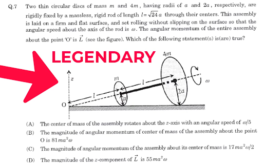

# Problema 1 — Dos discos rodando sin deslizar

**Fecha:** 2 de septiembre de 2026

## 1. Problema

Se tienen dos discos delgados de masas `m` y `4m`, con radios `a` y `2a`,
respectivamente. Los discos están unidos rígidamente mediante una varilla
de masa despreciable y el conjunto rueda sin deslizar sobre una superficie
horizontal.

Se pide determinar cuáles de las afirmaciones propuestas son verdaderas.

---

## 2. Mi primer intento

Antes de consultar a la IA...

---

## 3. Primera interacción con la IA

### Prompt

> [Aquí va el prompt exacto]

### Resultado

La IA concluyó inicialmente que las opciones A y C eran correctas.

### Hipótesis identificadas

1. ...
2. ...
3. ...

### Mi evaluación

...

---

## 4. Corrección del profesor

El profesor indicó que solamente la opción A era correcta.

Esto llevó a revisar...

---

## 5. Segundo prompt

> [Prompt exacto]

### Nueva respuesta de la IA

...

### Hipótesis modificada

**Hipótesis inicial:**

...

**Hipótesis corregida:**

...

### Resultado

Después de modificar esta hipótesis, la IA concluyó que solamente
la opción A era correcta.

---

## 6. Reflexión

...