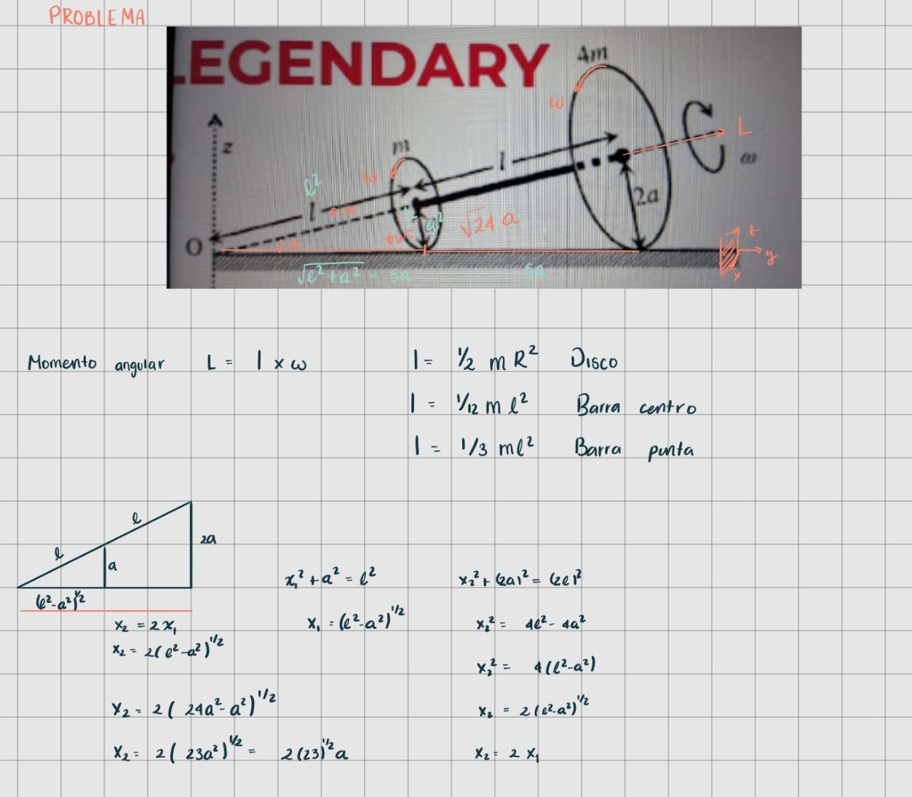

# Problema 1 — Dos discos rodando sin deslizar

**Fecha:** 2 de septiembre de 2026

## 1. Problema

Se tienen dos discos delgados de masas `m` y `4m`, con radios `a` y `2a`,
respectivamente. Los discos están unidos rígidamente mediante una varilla
de masa despreciable y el conjunto rueda sin deslizar sobre una superficie
horizontal.

Se pide determinar cuáles de las afirmaciones propuestas son verdaderas.

---

## 2. Mi primer intento

Antes de consultar a la IA este fue mi primer intento de resolver el problema, se dieron 20 minutos para resolverlos. En mi caso, el tiempo de analisis y de las hipotesis que yo tome no fue suficiente para resolver siquiera el primer problema. Aqui mis avances en 20 minutos tras un analisis e hipotesis.

---

## 3. Primera interacción con la IA

### Prompt

>>Soluciona este problema, por favor en cada apartado dime las hipótesis que se ponen en la mesa para solucionar el problema.

### Resultado

La IA concluyó inicialmente que las opciones A y C eran correctas. Tardo 1 min 39 seg en responder. 

### Hipótesis identificadas

#### Hipotesis para la pregunta A
1. Rodadura sin deslizamiento.
2. El punto de contacto instantáneo con el suelo tiene velocidad cero.
3. El disco pequeño gira alrededor del eje de la varilla con velocidad angular $\omega$.
4. La velocidad lineal asociada al borde del disco pequeño es $v=\omega a$.
5. La velocidad lineal asociada al borde del disco pequeño es $5a$.
6. El centro de masa está a $9a$ de O.
7. Para los momentos de inercia se uso $I_{\rm disco}=\frac12MR^2$, $I_{\rm diámetro}=\frac14MR^2$ y el teorema de ejes paralelos.

### Mi evaluación

Hubo algo que la IA no identificó o que asumió, con lo cual tanto yo como el profesor estábamos de acuerdo. Para calcular el momento angular respecto al CM no se puede considerar únicamente la rotación $\omega$ alrededor de la varilla. El conjunto también está rotando alrededor del eje $z$ con velocidad angular $\omega/5$.

---

## 4. Corrección del profesor

El profesor indicó que solamente la opción A era correcta.

Esto llevó a revisar efectivamente que la respuesta C estaba considerando una hipótesis incorrecta o le hacía falta considerar algunas hipótesis más.

---

## 5. Segundo prompt

> [De hecho la respuesta correcta es solamente la A, la C es falsa]

### Nueva respuesta de la IA

Tienes razón. Mi afirmación anterior de que C era verdadera fue incorrecta. Cometí un error importante: para calcular el momento angular respecto al CM no se puede considerar únicamente la rotación $\omega$ alrededor de la varilla. El conjunto también está rotando alrededor del eje $z$ con velocidad angular $\omega/5$.

La respuesta correcta es:

$$ \boxed{\mathbf{A}\text{ solamente}} $$

Vamos a corregir especialmente C, que es donde está el detalle conceptual.

### Hipótesis modificada

* **Asunción:** El sistema solo rota alrededor del eje de la varilla con velocidad angular $\boldsymbol{\omega}$.
* **Planteamiento:** $\mathbf{L}_{\text{CM}} = I_{\parallel} \boldsymbol{\omega}$
* **Cálculo de Inercia:** 
  $$I_{\parallel} = \frac{1}{2}m a^2 + \frac{1}{2}(4m)(2a)^2 = \frac{17}{2}m a^2$$
* **Resultado Asumido:** 
  $$\mathbf{L}_{\text{CM}} = \frac{17}{2}m a^2 \boldsymbol{\omega}$$

**Hipótesis corregida:**

- **Asunción:** Existe un *movimiento compuesto* (rotación sobre la varilla + precesión alrededor del eje $z$).
- **Planteamiento:** La velocidad angular total incluye ambas componentes: $\boldsymbol{\Omega}_{\text{total}} = \omega \hat{e} + \frac{\omega}{5} \hat{z}$
- **Vector de Momento Angular:** Como los momentos de inercia varían según la dirección ($I_{\parallel} \neq I_{\perp}$), se calcula vectorialmente: 

$$\mathbf{L}_{\text{CM}} = I_{\parallel} \boldsymbol{\Omega}_{\parallel} + I_{\perp} \boldsymbol{\Omega}_{\perp}$$

- **Conclusión:** $$\mathbf{L}_{\text{CM}} \neq I_{\parallel} \boldsymbol{\omega}$$ *(La opción C es falsa).*
### Resultado

Después de modificar esta hipótesis, la IA concluyó que solamente
la opción A era correcta.

---

## 6. Reflexión

A la IA le costó notoriamente resolver el problema en comparación con algunas tareas simples que anteriormente le he pedido; su respuesta inicial le tomó 1 min 39 seg. Al principio noté que realmente no resolvió el problema, solo buscó en la web la solución y únicamente la transcribió, por lo que su primera respuesta fue incorrecta, ya que la opción C también era incorrecta. Al darle el segundo *prompt* y decirle que la opción C era falsa, fue muy complaciente; aun así, indicó qué hipótesis fue la incorrecta y corrigió. Me atreví a decirle también que la opción A era incorrecta, ya que quería ver qué tan complaciente era, y así fue: su tercera respuesta fue que la opción A también era incorrecta, es decir, la llevé a equivocarse solo por ser complaciente.