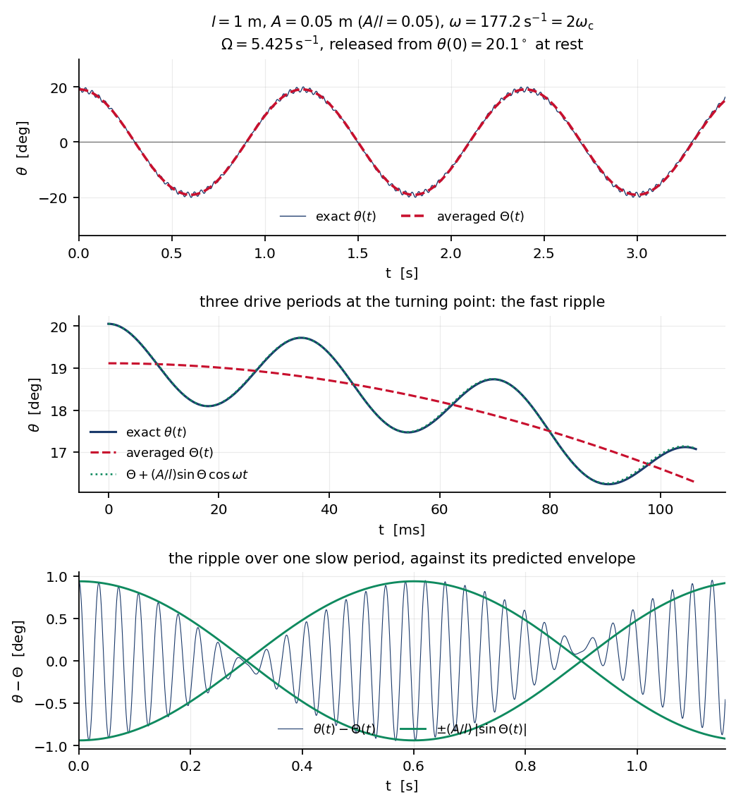
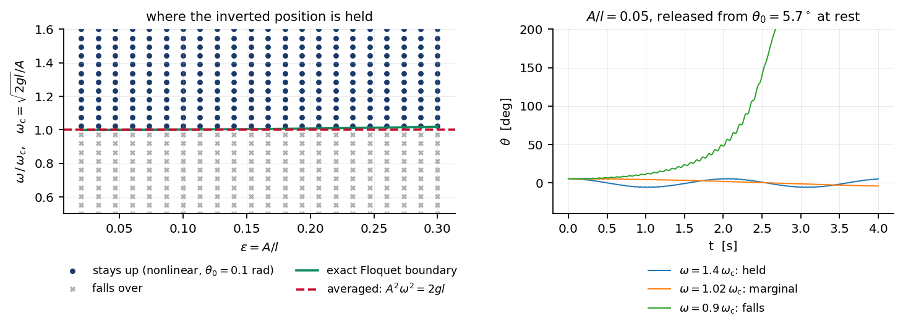
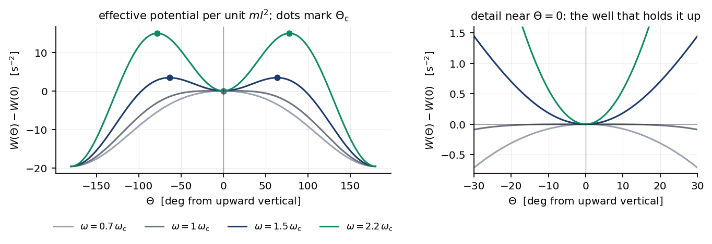

# P002 — Inverted pendulum with a vertically oscillating pivot — answer 1

Solver: `claude-opus-5`. Templates: prompt0 v1.3, conventions v1.3.
Date: 2026-09-13. Tools used: code execution (sympy, numpy, scipy, matplotlib)
and web retrieval.

Tags follow `CONVENTIONS.md` §1. Code listings for every `[N]` check are in the
appendix, verbatim; the same files are in `assets/code/`, and every printed
output quoted in §4 is the verbatim contents of the corresponding
`assets/code/out_*.txt`.

---

## 1. Prior-knowledge declaration

**Do I recognize this problem, and from where?** Yes, immediately, and in two
ways. It is the Kapitza pendulum — dynamic stabilization of the inverted
position by rapid vertical vibration of the support — which I know as a standard
worked example in the classical-mechanics literature. I also recognized the
specific wording as a Harvard "Problem of the Week" sheet by David Morin, which
prompt0 §1 states outright. I did not open either source before deriving; see
the ordering note below.

**What result do I believe is the standard one?** Written out before deriving
anything, from recall alone:

- The pendulum does not fall because the fast shaking of the pivot, averaged
  over a drive period, contributes a term to an effective potential that has a
  minimum at the inverted position. The size of that term goes like the square
  of the amplitude of the fast wiggle, which itself is proportional to the sine
  of the angle from the vertical, so the extra potential is proportional to
  $\sin^2$ of that angle — a hill at the horizontal, hence a well at both
  vertical positions.
- The inverted position is stable when $A^2\omega^2 > 2gl$.
- The slow oscillation frequency is
  $\Omega=\sqrt{\dfrac{A^2\omega^2}{2l^2}-\dfrac{g}{l}}$, reducing to
  $\Omega\approx A\omega/(\sqrt2\,l)$ when $A\omega\gg\sqrt{gl}$.

**What is the standard route, and where is it presented?** The route I recall is
Kapitza's separation of the motion into a slow part and a fast part, with the
fast part solved first and then averaged out, producing an effective potential
for the slow part. I recall this being presented in Landau and Lifshitz,
*Mechanics*, in the section on motion in a rapidly oscillating field, which I
believe is §30 — recalled, not checked at the time of writing this section. I
also recall the alternative route, which treats the linearized problem as a
Mathieu equation and extracts the stability tongue.

**What am I anchored on?** On the three bullets above, which I wrote from memory
and which the derivation below then had to reproduce. Section 3c of prompt0 says
only "we expect some sort of equilibria", which is too weak to anchor anything,
though it is worth sharpening and I do so in §5. The honest statement is that I
knew the target before I started, so the value of this document lies in whether
each step is forced, and in whether the checks in §4 could have failed. I have
tried to make both auditable: every numerical check in §4 is run not only on my
claim but on deliberately mutated versions of it, and the mutants are reported
alongside.

**Ordering note, which matters for the audit.** The derivation in §3 and every
computation in §4 were completed and their outputs recorded before any source
was retrieved. The retrieval in §8 happened afterwards, for the sole purpose of
resolving prompt0's general reference into a locator and checking it, as §6.3
requires. The comparison with what was retrieved is in §6. I mention this
because the previous problem in this repository failed precisely by retrieving a
published solution instead of deriving one, and the ordering is the only thing
that distinguishes the two cases from the outside.

---

## 2. Setup

### 2.1 Conventions

SI units throughout. The motion is planar. The angle $\theta$ is measured from
the **upward** vertical, so $\theta=0$ is the inverted (upside-down) position
and $\theta=\pi$ is the ordinary hanging position. `[A]` This is a convention,
not a physical assumption; it costs nothing and it is chosen because the
question is about the inverted position. Nothing breaks if the opposite
convention is used, beyond a relabelling $\theta\to\pi-\theta$.

Averages written $\langle\cdot\rangle$ are over one drive period
$T=2\pi/\omega$, at fixed slow variables.

### 2.2 Symbol table

| Symbol | Meaning | Units |
|---|---|---|
| $m$ | mass of the bob | kg |
| $l$ | length of the massless stick | m |
| $g$ | gravitational acceleration, $g>0$ | m s$^{-2}$ |
| $A$ | amplitude of the pivot's vertical oscillation, $A\ll l$ | m |
| $\omega$ | angular frequency of the pivot's oscillation | s$^{-1}$ |
| $y_p(t)=A\cos\omega t$ | vertical position of the pivot | m |
| $\theta(t)$ | angle of the stick from the upward vertical | rad |
| $\Theta(t)$ | slow part of $\theta$ | rad |
| $\xi(t)$ | fast part of $\theta$, $\langle\xi\rangle=0$ | rad |
| $\varepsilon=A/l$ | small parameter | — |
| $\omega_0=\sqrt{g/l}$ | natural frequency of the unshaken pendulum | s$^{-1}$ |
| $\Omega$ | frequency of the slow back-and-forth motion | s$^{-1}$ |
| $\omega_{\rm c}=\sqrt{2gl}/A$ | threshold drive frequency | s$^{-1}$ |
| $W(\Theta)$ | effective potential per unit $ml^2$ | s$^{-2}$ |
| $U_{\rm eff}=ml^2W$ | effective potential | J |
| $\Theta_{\rm c}$ | angle of the barrier bounding the inverted well | rad |

### 2.3 The problem, restated precisely

A point mass $m$ is fixed to one end of a rigid massless stick of length $l$.
The other end is constrained to the vertical line $x=0$ and is driven along it
with prescribed position $y_p(t)=A\cos\omega t$, with $A\ll l$. The stick may
rotate freely about the pivot in a fixed vertical plane. Gravity is uniform and
downward. There is no friction and no air.

Two things are asked. First, why the configuration $\theta=0$ — which for
$A=0$ is unstable — can fail to be abandoned when $\omega$ is large. Second, the
frequency of the slow oscillation about $\theta=0$ that replaces the fall.

Note that $\theta\equiv0$ and $\theta\equiv\pi$ are **exact** solutions of the
exact equation of motion derived below, for any $A$ and $\omega$: with the stick
vertical there is no torque about the pivot, and the bob simply translates with
the pivot. `[D]` So the question is not whether an equilibrium exists — two do,
exactly — but whether $\theta=0$ is stable. That distinction matters for §4,
because it means the stability question can be settled exactly by Floquet
theory, with no averaging, and that is what check N4 does.

---

## 3. Derivation

### 3.1 Coordinates and the Lagrangian

The pivot is at $(0,\,y_p(t))$ and the bob at

$$x = l\sin\theta,\qquad y = y_p + l\cos\theta. \tag{1}$$

Differentiating,

$$\dot x = l\dot\theta\cos\theta, \tag{2}$$
$$\dot y = \dot y_p - l\dot\theta\sin\theta,\qquad
  \dot y_p = -A\omega\sin\omega t. \tag{3}$$

The kinetic energy is $T=\tfrac12 m(\dot x^2+\dot y^2)$. Writing the two squares
out,

$$\dot x^2 = l^2\dot\theta^2\cos^2\theta, \tag{4}$$
$$\dot y^2 = \dot y_p^2 - 2l\,\dot y_p\dot\theta\sin\theta
            + l^2\dot\theta^2\sin^2\theta, \tag{5}$$

and adding them, the two $l^2\dot\theta^2$ pieces combine through
$\cos^2\theta+\sin^2\theta=1$:

$$\dot x^2+\dot y^2 = l^2\dot\theta^2 + \dot y_p^2
    - 2l\,\dot y_p\dot\theta\sin\theta, \tag{6}$$

so that

$$T = \tfrac12 m l^2\dot\theta^2 + \tfrac12 m\dot y_p^2
      - m l\,\dot y_p\dot\theta\sin\theta. \tag{7}$$

The potential energy is

$$V = mgy = mg\,y_p + mgl\cos\theta, \tag{8}$$

and therefore

$$L = T-V = \tfrac12 m l^2\dot\theta^2
      - m l\,\dot y_p\dot\theta\sin\theta
      - mgl\cos\theta
      \;+\;\underbrace{\tfrac12 m\dot y_p^2 - mg\,y_p}_{\text{function of }t
      \text{ alone}}. \tag{9}$$

`[D]` The bracketed group depends on $t$ only. Both $\partial/\partial\theta$
and $\partial/\partial\dot\theta$ annihilate it, so it cannot appear anywhere in
the Euler–Lagrange equation for $\theta$ and may be dropped. (It is not
necessary to invoke the weaker "total time derivative" argument; a function of
$t$ alone is killed directly.) Keep

$$\tilde L = \tfrac12 m l^2\dot\theta^2
      - m l\,\dot y_p\dot\theta\sin\theta - mgl\cos\theta. \tag{10}$$

### 3.2 Equation of motion

$$\frac{\partial\tilde L}{\partial\dot\theta}
   = m l^2\dot\theta - m l\,\dot y_p\sin\theta, \tag{11}$$

$$\frac{d}{dt}\frac{\partial\tilde L}{\partial\dot\theta}
   = m l^2\ddot\theta - m l\,\ddot y_p\sin\theta
     - m l\,\dot y_p\dot\theta\cos\theta, \tag{12}$$

$$\frac{\partial\tilde L}{\partial\theta}
   = - m l\,\dot y_p\dot\theta\cos\theta + mgl\sin\theta. \tag{13}$$

Subtracting (13) from (12) and setting the result to zero,

$$m l^2\ddot\theta - m l\,\ddot y_p\sin\theta
  - m l\,\dot y_p\dot\theta\cos\theta
  + m l\,\dot y_p\dot\theta\cos\theta
  - mgl\sin\theta = 0. \tag{14}$$

`[D]` The two terms in $\dot y_p\dot\theta\cos\theta$ cancel identically. This
cancellation is worth pausing on: it is why the pivot's *velocity* drops out
entirely and only its *acceleration* survives. Dividing by $ml$,

$$l\ddot\theta = \bigl(g+\ddot y_p\bigr)\sin\theta. \tag{15}$$

With $\ddot y_p = -A\omega^2\cos\omega t$,

$$\boxed{\;l\ddot\theta = \bigl(g - A\omega^2\cos\omega t\bigr)\sin\theta\;}
  \tag{16}$$

`[D]` Equation (15) says exactly what the equivalence principle would say: in
the frame of the accelerating pivot the bob feels an effective gravitational
acceleration $g_{\rm eff}(t)=g+\ddot y_p$, and the pendulum equation is the
usual one with $g\to g_{\rm eff}$. This is a consistency remark, not an
independent derivation; the independent derivation is the Newtonian one in check
N2, which does not pass through a Lagrangian at all.

Setting $A=0$ in (16) gives $l\ddot\theta = g\sin\theta$, the rigid pendulum
measured from the top, whose linearization $\ddot\theta=\omega_0^2\theta$ grows
like $e^{\omega_0 t}$. `[D]` That is the fall the problem asks us to explain
away.

It is convenient to divide (16) by $l$ and introduce $\varepsilon=A/l$ and
$\omega_0^2=g/l$:

$$\ddot\theta = \bigl(\omega_0^2 - \varepsilon\omega^2\cos\omega t\bigr)
                \sin\theta. \tag{17}$$

### 3.3 Separation of the fast and slow motions

`[A]` **Assumption 1 (two timescales).** Write

$$\theta(t) = \Theta(t) + \xi(t),\qquad \langle\xi\rangle=0, \tag{18}$$

where $\xi$ oscillates at the drive frequency $\omega$ with amplitude
$O(\varepsilon)$, and $\Theta$ varies only on a timescale long compared with
$T=2\pi/\omega$. What this buys: it converts a non-autonomous equation into an
autonomous one for $\Theta$. What breaks without it: if the two timescales are
not separated — if $\Omega$ is comparable to $\omega$, or if $\xi$ is not small
— then $\xi$ cannot be solved for at leading order independently of $\Theta$ and
the whole construction collapses. §3.6 shows that the separation is a
consequence of $A\ll l$ rather than an extra hypothesis, and check N3 measures
the error it commits.

Substituting (18) into (17) and expanding the sine,

$$\sin(\Theta+\xi) = \sin\Theta\cos\xi + \cos\Theta\sin\xi
   = \sin\Theta + \xi\cos\Theta + O(\xi^2), \tag{19}$$

so

$$\ddot\Theta + \ddot\xi
 = \bigl(\omega_0^2-\varepsilon\omega^2\cos\omega t\bigr)
   \bigl(\sin\Theta + \xi\cos\Theta\bigr) + O(\xi^2). \tag{20}$$

`[A]` **Assumption 2 (truncation).** Terms of $O(\xi^2)=O(\varepsilon^2)$
*inside the sine* are dropped. What it buys: (20) becomes linear in $\xi$. What
breaks: the retained slow equation is then accurate only to leading order; the
neglected terms are of relative size $\varepsilon^2$, and check N3 measures
exactly that and finds the predicted second-order convergence.

Before splitting (20), count the sizes of the terms, since the split is the one
place where knowing the answer could do the work instead of the argument:

| term | size |
|---|---|
| $\varepsilon\omega^2\cos\omega t\,\sin\Theta$ | $\varepsilon\omega^2$ |
| $\ddot\xi$ | $\omega^2\xi \sim \varepsilon\omega^2$ |
| $\varepsilon\omega^2\cos\omega t\;\xi\cos\Theta$ | $\varepsilon^2\omega^2$ |
| $\ddot\Theta$ | $\Omega^2\Theta \sim \varepsilon^2\omega^2$ |
| $\omega_0^2\sin\Theta$ | $\omega_0^2 \ll \varepsilon^2\omega^2$ near threshold and above |

`[D]` There are two distinct orders present, $\varepsilon\omega^2$ and
$\varepsilon^2\omega^2$. The first pair must balance each other, and the second
group must balance among themselves. Nothing here is a choice.

### 3.4 The fast equation

At order $\varepsilon\omega^2$, (20) gives

$$\ddot\xi = -\varepsilon\omega^2\cos(\omega t)\,\sin\Theta. \tag{21}$$

`[A]` **Assumption 3.** $\Theta$ is held fixed while (21) is integrated over one
drive period, which is legitimate precisely because $\Theta$ is slow. Integrating
twice,

$$\dot\xi = -\varepsilon\omega\sin\Theta\,\sin(\omega t) + c_1, \tag{22}$$
$$\xi = \varepsilon\sin\Theta\,\cos(\omega t) + c_1 t + c_2. \tag{23}$$

`[D]` $c_1=0$: a nonzero $c_1$ produces a term growing linearly in $t$, which
contradicts the assumption that $\xi$ stays $O(\varepsilon)$. $c_2=0$: a
constant in $\xi$ is by definition part of the slow motion and has already been
named $\Theta$, and it is excluded by $\langle\xi\rangle=0$. Hence

$$\xi = \varepsilon\sin\Theta\,\cos\omega t
      = \frac{A}{l}\sin\Theta\,\cos\omega t. \tag{24}$$

Two things are worth noticing about (24), because they are the mechanism of the
whole effect. First, the two powers of $\omega$ brought down by $\ddot y_p$ are
removed exactly by the double integration, so the amplitude of the fast wiggle
is $\varepsilon\sin\Theta$, independent of $\omega$. Second, that amplitude is
proportional to $\sin\Theta$: the further the stick leans, the harder the shaking
rattles it. `[D]` Check N6 measures both statements directly.

### 3.5 Averaging, and the effective potential

Average (20) over one drive period at fixed $\Theta,\dot\Theta$. Term by term:

$$\langle\ddot\xi\rangle = \frac{1}{T}\bigl[\dot\xi\bigr]_0^T = 0
  \quad\text{since }\dot\xi\text{ is }T\text{-periodic}, \tag{25}$$
$$\langle\cos\omega t\rangle = 0,\qquad \langle\xi\rangle = 0, \tag{26}$$
$$\langle \cos(\omega t)\,\xi\rangle
 = \varepsilon\sin\Theta\,\langle\cos^2\omega t\rangle
 = \tfrac12\,\varepsilon\sin\Theta. \tag{27}$$

`[D]` Equation (27) is the crux. The driving term in (17) is proportional to
$\cos\omega t$, and the wiggle it produces is *also* proportional to
$\cos\omega t$ — in phase, because (21) is a pure second derivative with no
damping. A product of two quantities each averaging to zero need not average to
zero, and here it does not: $\langle\cos^2\rangle=\tfrac12$. The factor
$\tfrac12$ in the final answer comes from here and from nowhere else, and it is
not adjustable.

Averaging (20) and using (25)–(27),

$$\ddot\Theta = \omega_0^2\sin\Theta
   - \varepsilon\omega^2\cdot\tfrac12\varepsilon\sin\Theta\,\cos\Theta,$$

that is

$$\boxed{\;\ddot\Theta = \frac{g}{l}\sin\Theta
   - \frac{A^2\omega^2}{2l^2}\sin\Theta\cos\Theta\;} \tag{28}$$

Write (28) as $\ddot\Theta = -\,dW/d\Theta$. Using
$\sin\Theta\cos\Theta=\tfrac12\sin2\Theta$ and
$\sin^2\Theta=\tfrac12(1-\cos2\Theta)$,

$$W(\Theta) = \frac{g}{l}\cos\Theta
   + \frac{A^2\omega^2}{4l^2}\sin^2\Theta. \tag{29}$$

Verifying by differentiation, step by step:

$$\frac{dW}{d\Theta}
 = -\frac{g}{l}\sin\Theta
   + \frac{A^2\omega^2}{4l^2}\cdot 2\sin\Theta\cos\Theta
 = -\frac{g}{l}\sin\Theta
   + \frac{A^2\omega^2}{2l^2}\sin\Theta\cos\Theta, \tag{30}$$

so $-dW/d\Theta$ reproduces the right-hand side of (28) exactly. Multiplying by
$ml^2$ to get an energy,

$$U_{\rm eff}(\Theta) = mgl\cos\Theta
  + \frac{mA^2\omega^2}{4}\sin^2\Theta. \tag{31}$$

`[D]` **The added term is the time-averaged kinetic energy of the fast motion.**
From (24), $\dot\xi=-\varepsilon\omega\sin\Theta\sin\omega t$, so the kinetic
energy carried by the fast part of the angular motion is

$$\Bigl\langle \tfrac12 m l^2\dot\xi^2\Bigr\rangle
 = \tfrac12 m l^2\varepsilon^2\omega^2\sin^2\Theta
   \langle\sin^2\omega t\rangle
 = \frac{m A^2\omega^2}{4}\sin^2\Theta, \tag{32}$$

identical to the second term of (31). This is an internal consistency check of
the algebra that costs nothing and would have caught a wrong factor in (27): the
mean kinetic energy stored in the jitter acts as a potential for the slow
motion, largest where the jitter is largest, at $\Theta=\pi/2$. That hill at the
horizontal is what holds the pendulum up.

### 3.6 Equilibria, stability, and the slow frequency

From (30), the stationary points of $W$ satisfy

$$\sin\Theta\Bigl[-\frac{g}{l} + \frac{A^2\omega^2}{2l^2}\cos\Theta\Bigr]=0,
  \tag{33}$$

giving $\Theta=0$, $\Theta=\pi$, and, when the bracket can vanish,

$$\cos\Theta_{\rm c} = \frac{2gl}{A^2\omega^2},
  \qquad\text{which has a solution iff } A^2\omega^2\ge 2gl. \tag{34}$$

Differentiating (30) once more,

$$\frac{d^2W}{d\Theta^2}
 = -\frac{g}{l}\cos\Theta + \frac{A^2\omega^2}{2l^2}\cos2\Theta. \tag{35}$$

At the inverted position,

$$W''(0) = -\frac{g}{l} + \frac{A^2\omega^2}{2l^2}, \tag{36}$$

so $\Theta=0$ is a minimum of $W$, and hence stable for the slow dynamics,
precisely when

$$\boxed{\;A^2\omega^2 > 2gl
  \quad\Longleftrightarrow\quad
  \omega > \omega_{\rm c}\equiv\frac{\sqrt{2gl}}{A}
  \quad\Longleftrightarrow\quad
  \frac{A\omega}{l} > \sqrt{2}\,\omega_0 \;} \tag{37}$$

At the hanging position, $\cos\pi=-1$ and $\cos2\pi=1$, so

$$W''(\pi) = \frac{g}{l} + \frac{A^2\omega^2}{2l^2} > 0 \quad\text{always},
  \tag{38}$$

`[D]` i.e. shaking the pivot never destabilizes the hanging position at this
order, and stiffens it: the slow frequency about $\Theta=\pi$ is
$\sqrt{g/l+A^2\omega^2/2l^2}$, which reduces to $\omega_0$ as $A\to0$. That
reduction is one of the self-checks in §4.6.

At $\Theta_{\rm c}$, writing $q\equiv\cos\Theta_{\rm c}=2gl/(A^2\omega^2)$ and
using $g/l = \tfrac12 q\,A^2\omega^2/l^2$ from (34),

$$W''(\Theta_{\rm c})
 = -\frac{g}{l}q + \frac{A^2\omega^2}{2l^2}\bigl(2q^2-1\bigr)
 = \frac{A^2\omega^2}{2l^2}\bigl(-q^2 + 2q^2 - 1\bigr)
 = \frac{A^2\omega^2}{2l^2}\bigl(q^2-1\bigr) < 0 \tag{39}$$

for $q<1$. `[D]` So $\Theta_{\rm c}$ is a maximum of $W$: it is the top of the
barrier separating the inverted well from the fall toward $\Theta=\pi$. The
"back and forth motion" of the problem statement is motion inside that well, and
it exists only for $|\Theta|<\Theta_{\rm c}$.

Finally, for small departures from the inverted position, expand (28) with
$\sin\Theta\approx\Theta$, $\cos\Theta\approx1$:

$$\ddot\Theta = \Bigl(\frac{g}{l}-\frac{A^2\omega^2}{2l^2}\Bigr)\Theta
  = -\,W''(0)\,\Theta, \tag{40}$$

which is simple harmonic with

$$\boxed{\;\Omega = \sqrt{\frac{A^2\omega^2}{2l^2}-\frac{g}{l}}
  = \sqrt{\frac{A^2\omega^2-2gl}{2l^2}}\;} \tag{41}$$

and, when $A\omega\gg\sqrt{gl}$,

$$\Omega \simeq \frac{A\omega}{\sqrt2\,l}. \tag{42}$$

### 3.7 Is the timescale separation self-consistent?

This has to be checked rather than assumed, because Assumption 1 was used to get
(41) and (41) is what tells us whether Assumption 1 holds. From (41),

$$\frac{\Omega}{\omega}
 = \sqrt{\frac{\varepsilon^2}{2}-\frac{\omega_0^2}{\omega^2}}
 < \frac{\varepsilon}{\sqrt2}. \tag{43}$$

`[D]` So the slow frequency is smaller than the drive frequency by at least
$\varepsilon/\sqrt2$, for *every* parameter set where the inverted position is
stable at all. The separation of timescales is therefore a consequence of
$A\ll l$, not an independent assumption — a point worth making because it is
easy to present it as one and thereby hide a circularity. Similarly, (37) forces

$$\omega > \frac{\sqrt2\,\omega_0}{\varepsilon} \gg \omega_0, \tag{44}$$

so "$\omega$ large enough" in the problem statement is not vague: stability
itself requires the drive to be fast compared with the pendulum's own natural
frequency, by a factor at least $\sqrt2/\varepsilon$.

### 3.8 Behaviour exactly at threshold

Expanding (29) to fourth order, with $\cos\Theta=1-\Theta^2/2+\Theta^4/24$ and
$\sin^2\Theta=\Theta^2-\Theta^4/3$,

$$W = \omega_0^2
 + \tfrac12\Theta^2\Bigl(\frac{\varepsilon^2\omega^2}{2}-\omega_0^2\Bigr)
 + \Theta^4\Bigl(\frac{\omega_0^2}{24}-\frac{\varepsilon^2\omega^2}{12}\Bigr)
 + O(\Theta^6)
 \;\equiv\; \omega_0^2 + \tfrac12\Omega^2\Theta^2 + \beta\Theta^4, \tag{45}$$

$$\beta = \frac{\omega_0^2}{24}-\frac{\varepsilon^2\omega^2}{12}
       = -\Bigl(\frac{\Omega^2}{6}+\frac{\omega_0^2}{8}\Bigr), \tag{46}$$

where the second form uses $\varepsilon^2\omega^2=2(\Omega^2+\omega_0^2)$ from
(41). `[D]` $\beta<0$ always. At threshold $\Omega=0$ and
$\beta=-\omega_0^2/8<0$, so $W$ has a quartic *maximum* at $\Theta=0$: exactly
at $A^2\omega^2=2gl$ the inverted position is unstable, and the inequality in
(37) is strict. This also means the effective well is anharmonic in the softening
direction — the slow period lengthens with amplitude — which §4.4 uses
quantitatively.

---

## 4. Verification

Six computational checks, then the self-check battery. Every script is
standalone, runs from a clean interpreter, pins its library versions in a
comment, and fixes a seed where randomness is used. Library versions as run:

```
python 3.11.15, sympy 1.14.0, numpy 2.4.4, scipy 1.17.1, matplotlib 3.10.9
```

The code is reproduced verbatim in the appendix and lives in `assets/code/`.
Outputs below are verbatim; nothing is paraphrased or abridged.

A general remark on how these checks are built, since it is the part most worth
attacking. A passing check on a claim I already believe is weak evidence. Every
check below therefore also runs against **deliberately mutated** versions of the
claim — a flipped sign, a missing factor of two, a dropped $\sin\Theta$ — and
reports whether the mutant is rejected. A check that cannot reject a mutant is
reported as vacuous rather than as a pass. Where the underlying claim is
asymptotic, the check is a **convergence test** rather than a fixed-tolerance
test: the residual is required to vanish at the predicted order in $\varepsilon$,
which is a much harder target to hit by accident than a single tolerance.

### 4.1 Check N1 — the equation of motion, symbolically, from the geometry

`[N]` What it tests: that (16) follows from (1)–(10). The script builds $x(t)$
and $y(t)$ from the geometry, forms $T$ and $V$ from their definitions, applies
the Euler–Lagrange operator through sympy, solves for $\ddot\theta$, and
subtracts the claim. No expression from §3.2 is reused.

Output:

```text
L = m*(-2*g*(A*cos(omega*t) + l*cos(theta(t))) + l**2*cos(theta(t))**2*Derivative(theta(t), t)**2 + (A*omega*sin(omega*t) + l*sin(theta(t))*Derivative(theta(t), t))**2)/2
Euler-Lagrange expression (should equal 0):
l*m*(A*omega**2*sin(theta(t))*cos(omega*t) - g*sin(theta(t)) + l*Derivative(theta(t), (t, 2)))
theta'' solved from Euler-Lagrange:
    (-A*omega**2*cos(omega*t) + g)*sin(theta(t))/l
claimed theta'' = (-A*omega**2*cos(omega*t) + g)*sin(theta(t))/l
residual (solved - claimed) = 0
CHECK N1: PASS
residual against sign-flipped mutant = -2*A*omega**2*sin(theta(t))*cos(omega*t)/l
MUTANT REJECTED: yes
A -> 0 limit of theta'': g*sin(theta(t))/l
```

What this would have caught: any algebra slip between (1) and (16) — a dropped
cross term in (6), a sign error in (12) or (13), a failure of the
$\dot y_p\dot\theta\cos\theta$ cancellation. The sign-flipped mutant is rejected
with a nonzero residual, so the test is not vacuous.

What it would **not** have caught: a wrong setup. If (1) itself encoded the
geometry incorrectly — the pivot moving horizontally, say, or $\theta$ measured
from the wrong axis — sympy would faithfully derive the equation of motion for
that wrong problem and report PASS. It also says nothing about §3.3 onwards.
Check N2 addresses the first gap; checks N3–N5 address the second.

### 4.2 Check N2 — the equation of motion against Newton with a constraint force

`[N]` What it tests: (16) against a second formulation of the same mechanics
that never forms a Lagrangian. Newton's second law is written in Cartesian
components for the bob, the rigid stick is represented by a force of unknown
magnitude directed along it, and that magnitude is eliminated by differentiating
$|{\bf r}-{\bf p}(t)|^2=l^2$ twice. Both systems are started from the same
physical state and integrated with DOP853; the angles are compared.

**This check failed on its first run, and the failure is reported here before
the revision.** The first version applied one criterion to all eight parameter
sets: $\max|\Delta\theta|<10^{-6}$ rad over a 6 s window at `rtol=1e-11`. Set 8
failed it, with $\max|\Delta\theta|=4.4\times10^{-1}$. Set 8 has
$\omega/\omega_{\rm c}=0.47$, i.e. below threshold, so the pendulum falls and
then whirls, and in that regime the motion has a positive Lyapunov exponent: two
numerically exact but differently discretized integrations of the same equations
separate exponentially. The diagnostic run (`diag_set8.py`, also in
`assets/code/`) gave

```
rtol=1e-09  max|dth|=6.167e+00  max drift=5.794e-01  separation time=2.207 s  (tmax=6.00)
rtol=1e-11  max|dth|=4.432e-01  max drift=5.803e-01  separation time=3.385 s  (tmax=6.00)
rtol=1e-13  max|dth|=1.301e-02  max drift=1.453e-02  separation time=4.068 s  (tmax=6.00)
rtol=1e-14  max|dth|=9.992e-04  max drift=1.104e-03  separation time=4.341 s  (tmax=6.00)
```

The discrepancy falls by four orders of magnitude as the tolerance is tightened,
in lockstep with the independent witness $\bigl||{\bf u}|-l\bigr|/l$, which the
$\theta$-equation cannot drift in by construction, and the time at which the two
curves separate moves steadily later. That is integrator error, not a
disagreement between the two formulations.

**What I changed, and it was the check and not the derivation.** The
fixed-tolerance criterion is kept and its verdict reported unchanged; any set
that fails it is then put through a tolerance-refinement study, and a
discrepancy that falls with `rtol` is attributed to integration rather than to
physics. Nothing in §3 was touched. The cost of this is stated in the coverage
note below.

Output of the revised check (the eight-set table reproduces the first version's
numbers exactly, including the failure):

```text
CHECK N2 -- scalar theta-equation vs Newton-with-constraint-force.
Both integrations start from the same physical state.
Primary criterion: max|dtheta| < 1e-6 rad over the window at rtol=1e-11.
A real disagreement would show as a discrepancy that does NOT fall when
rtol is tightened.  Both integrators are DOP853, so a shared
discretisation bias is not credible at these tolerances.

set      l        A    omega  w/w_c      th0   tmax    max|dth|   |u|drift  verdict
  1  0.479  0.01001    486.2   1.59   0.0274   2.58   1.650e-11   2.07e-13  PASS
  2  0.461  0.01463    495.2   2.41  -0.1346   2.54   1.062e-10   2.14e-12  PASS
  3  0.897  0.01741    504.8   2.10  -0.2725   2.49   3.538e-12   5.16e-12  PASS
  4  0.913  0.03391    247.9   1.99   0.0991   5.07   3.221e-11   1.18e-12  PASS
  5  0.775  0.01829    364.6   1.71   0.0247   3.45   8.830e-12   2.63e-13  PASS
  6  1.318  0.03133    250.4   1.54  -0.1594   5.02   1.563e-11   1.71e-12  PASS
  7  0.752  0.01472    183.4   0.70   0.2748   6.00   2.214e-08   7.32e-10  PASS
  8  0.256  0.00886    119.7   0.47   0.0535   6.00   4.432e-01   5.80e-01  FAIL

Primary criterion: 7/8 sets passed.

Tolerance-refinement study on the set(s) that failed.
If the discrepancy is integrator error it falls with rtol, and the
constraint residual |u|-l falls with it.  If the two formulations
actually disagree, neither falls.
  set 8:  l=0.2564  A=0.00886  omega=119.7  th0=0.0535
     rtol=1e-08   max|dth|=1.033e+01   max||u|-l|/l=6.716e-01
     rtol=1e-10   max|dth|=1.218e+00   max||u|-l|/l=6.359e-01  (x1.18e-01)
     rtol=1e-12   max|dth|=8.278e-02   max||u|-l|/l=9.836e-02  (x6.80e-02)
     rtol=1e-13   max|dth|=1.301e-02   max||u|-l|/l=1.453e-02  (x1.57e-01)
     first 20 drive periods (t < 1.0499 s): max|dth|=1.325e-10  -> PASS

Mutation test (super-threshold set, where the primary criterion holds):
  claim as derived          : max|dtheta| = 6.495e-12
  driving term sign flipped : max|dtheta| = 1.597e-02
  MUTANT REJECTED: yes
```

What this would have caught: a wrong equation of motion, including the class of
error N1 cannot see, because the Newtonian route rebuilds the dynamics from
force balance and a geometric constraint rather than from $T-V$. The
sign-flipped mutant separates by $1.6\times10^{-2}$ rad against
$6.5\times10^{-12}$ for the claim, a ratio of $10^{9}$, so the check is not
vacuous. It would also have caught a wrong pivot acceleration, since $\ddot y_p$
enters both formulations independently.

What it would **not** have caught: a shared error in the geometry, which both
formulations inherit from (1) — if the pivot were supposed to move horizontally,
both would agree on the wrong answer. It would not catch anything about §3.3
onwards. And, as the failure showed, it certifies agreement only over times
short compared with the Lyapunov time in the whirling regime; in that regime the
check verifies the equations agree for the first tens of drive periods
($1.3\times10^{-10}$ rad over 20 drive periods for set 8) and nothing beyond.
For the regime the problem is actually about — near-inverted, above threshold —
agreement holds over the whole window at the $10^{-11}$ level.

### 4.3 Check N3 — the slow frequency, measured from the exact equation

`[N]` What it tests: equation (41), the headline result. The exact equation (16)
is integrated — no averaging anywhere inside the integrator — and the period of
the slow motion is read off from a straight-line fit to its zero-crossing times.
$\Omega$ enters only at the end, as the number being compared against.

The design point is that a single tolerance would prove little, so $\Omega$ is
held fixed at 6.000 s$^{-1}$ while $\varepsilon=A/l$ is swept down by a factor
of 16, with $\omega$ solved for at each step. The residual must then fall like
$\varepsilon^2$, the order of the first neglected term. Three quantities are
reported so that the two independent sources of discrepancy can be separated:
(a) measured period against the harmonic prediction $2\pi/\Omega$; (b) measured
period against the period of the averaged equation (28) at the same amplitude,
which isolates the error of the averaging; (c) the averaged equation's own
period against $2\pi/\Omega$, which is the anharmonic shift of §3.8 and is not
an error at all. The analytic size of (c), from (46) and the standard
amplitude-frequency relation for a quartic well, is printed for comparison.

Output:

```text
CHECK N3 -- slow frequency measured from the exact equation of motion.
g = 9.81, l = 1.0, theta(0) = 0.02 rad, thetadot(0) = 0.
Omega is held at 6.000 rad/s while eps = A/l is swept; omega is solved
for from the claim at each eps.  If the claim is right the measured
period converges on 2*pi/Omega like eps^2.  A residual that plateaus,
or that falls at the wrong order, is a failure.

Predicted anharmonic period shift at theta(0) = 0.02: +1.2044e-04 (relative).  This is an eps-independent floor under
comparison (a) and must NOT be read as an error of the averaging.

  eps=A/l         A      omega    w/Om     T_meas   (a)=T/Th-1   (b)=T/Tav-1  (c)=Tav/Th-1  (b)/eps^2 ncross    fitres
  0.10000   0.10000      95.72    16.0   1.039845   -7.021e-03    -7.141e-03    +1.205e-04      0.714     24  1.38e-03
  0.05000   0.05000     191.44    31.9   1.045450   -1.669e-03    -1.789e-03    +1.205e-04      0.716     24  3.53e-04
  0.02500   0.02500     382.87    63.8   1.046845   -3.365e-04    -4.569e-04    +1.205e-04      0.731     24  9.06e-05
  0.01250   0.01250     765.75   127.6   1.047203   +4.747e-06    -1.157e-04    +1.205e-04      0.740     24  2.30e-05
  0.00625   0.00625    1531.49   255.2   1.047293   +9.086e-05    -2.959e-05    +1.205e-04      0.758     24  5.75e-06

Decomposition check: (a) should equal (b) + (c) + O(second order).
  eps= 0.10000:  (a)=-7.0214e-03   (b)+(c)=-7.0205e-03   residual=-8.60e-07
  eps= 0.05000:  (a)=-1.6689e-03   (b)+(c)=-1.6687e-03   residual=-2.16e-07
  eps= 0.02500:  (a)=-3.3648e-04   (b)+(c)=-3.3643e-04   residual=-5.50e-08
  eps= 0.01250:  (a)=+4.7471e-06   (b)+(c)=+4.7610e-06   residual=-1.39e-08
  eps= 0.00625:  (a)=+9.0858e-05   (b)+(c)=+9.0862e-05   residual=-3.56e-09

Observed convergence orders (log-log slopes between consecutive eps).
Column (b) is the one that tests the averaging; (c) is eps-independent
by construction and is shown to confirm that.
  eps 0.10000 -> 0.05000:  order(b) =  2.00   (c) = +1.205e-04 -> +1.205e-04
  eps 0.05000 -> 0.02500:  order(b) =  1.97   (c) = +1.205e-04 -> +1.205e-04
  eps 0.02500 -> 0.01250:  order(b) =  1.98   (c) = +1.205e-04 -> +1.205e-04
  eps 0.01250 -> 0.00625:  order(b) =  1.97   (c) = +1.205e-04 -> +1.205e-04

MUTATION TEST.  The same measurement, but the period is compared with
mutant formulas.  Each mutant is used to solve for omega at eps = 0.02,
then the exact equation is integrated and the period measured.  A
mutant that survives would mean the check cannot tell formulas apart.
  claim   Omega^2 = A^2w^2/(2l^2) - g/l:  omega =    478.59  T_meas =  1.047021  rel err = 1.685e-04  -> consistent
  mutant  Omega^2 = A^2w^2/(1l^2) - g/l:  omega =    338.42  T_meas =  1.736141  rel err = 6.579e-01  -> REJECTED
  mutant  Omega^2 = A^2w^2/(4l^2) - g/l:  omega =    676.83  T_meas =  0.694530  rel err = 3.368e-01  -> REJECTED
  mutant  Omega^2 = A^2w^2/(2l^2) + g/l:  omega =    361.87  T_meas =  1.552277  rel err = 4.823e-01  -> REJECTED
```

Three things in that output are worth stating explicitly. Column (b), the
averaging error, falls at order $1.97$–$2.00$ over a factor of 16 in
$\varepsilon$, with coefficient settling near $0.75\varepsilon^2$. Column (c) is
$+1.205\times10^{-4}$ at every $\varepsilon$, against the independently computed
analytic prediction $+1.2044\times10^{-4}$ — agreement to four digits for a
quantity derived from (46), which did not enter the numerics. And the
decomposition $(a)=(b)+(c)$ closes to better than $10^{-6}$ relative at every
$\varepsilon$, which is why column (a) is non-monotonic: it passes through zero
near $\varepsilon=0.0125$ where the two effects cancel, and that is a feature of
the arithmetic, not an anomaly.

What this would have caught: any wrong numerical factor or wrong power in (41).
The three mutants — $\Omega^2=A^2\omega^2/l^2-g/l$,
$\Omega^2=A^2\omega^2/(4l^2)-g/l$, and $\Omega^2=A^2\omega^2/(2l^2)+g/l$ — are
rejected with relative errors of 66%, 34% and 48% against
$1.7\times10^{-4}$ for the claim. It would also have caught a wrong averaged
equation (28), since column (b) compares directly against it.

What it would **not** have caught: an error shared between (16) and the
integrator — but (16) is what N1 and N2 test, so the chain is closed. It does
not probe large slow amplitudes: $\theta(0)=0.02$ rad was used deliberately to
keep the anharmonic term small, so the check says nothing about the accuracy of
$\Omega$ as a description of motion with $|\Theta|$ approaching
$\Theta_{\rm c}$. It also does not test the stability threshold, only the
frequency above it, and it cannot distinguish (41) from any formula agreeing
with it to $O(\varepsilon^2)$.

### 4.4 Check N4 — the stability threshold, by exact Floquet theory

`[N]` What it tests: condition (37), by a route containing no averaging at all.
Because $\theta\equiv0$ is an exact solution of (16), its stability is exactly a
Floquet problem. Linearizing (17) about $\theta=0$ and putting $\tau=\omega t$,

$$\theta'' = \bigl(G-\varepsilon\cos\tau\bigr)\theta,
  \qquad G=\frac{g}{l\omega^2},\qquad {}'=\frac{d}{d\tau}, \tag{47}$$

a Hill equation of period $2\pi$. The monodromy matrix $M$ is built by
integrating from $(1,0)$ and $(0,1)$ over one period. There is no damping, so
$\det M=1$ exactly — printed as an independent witness of the integration — and
the origin is linearly stable iff $|\operatorname{tr}M|<2$. Condition (37) in
these variables reads $G_{\rm c}=\varepsilon^2/2$, and the check bisects on $G$
to find the exact boundary.

Output:

```text
CHECK N4 -- exact Floquet stability boundary of the linearised exact
equation, compared with the averaged prediction G_c = eps^2/2.
No averaging enters the computation; the only approximation is the
linearisation in theta, which is exact for the stability of theta = 0.

Sanity: at eps = 0 the equation is theta'' = G*theta, so
tr M = 2*cosh(2*pi*sqrt(G)) > 2 for every G > 0 -- always unstable.
   G = 1e-04:  tr M = 2.0039491407   2*cosh(2*pi*sqrt(G)) = 2.0039491407   det M - 1 = -3.3e-16
   G = 1e-02:  tr M = 2.4079441787   2*cosh(2*pi*sqrt(G)) = 2.4079441787   det M - 1 = +8.9e-16
   G = 1e+00:  tr M = 535.4935229675   2*cosh(2*pi*sqrt(G)) = 535.4935229675   det M - 1 = +1.5e-11

  eps=A/l      G_c exact        eps^2/2      ratio  (ratio-1)/eps^2   det M - 1
  0.40000    0.075098201    0.080000000   0.938728          -0.3830    -7.4e-15
  0.20000    0.019662322    0.020000000   0.983116          -0.4221    -7.4e-15
  0.10000    0.004978324    0.005000000   0.995665          -0.4335    -5.9e-15
  0.05000    0.001248636    0.001250000   0.998909          -0.4365    -7.8e-15
  0.02500    0.000312415    0.000312500   0.999727          -0.4372    -3.8e-15
  0.01250    0.000078120    0.000078125   0.999932          -0.4374    -1.0e-15

The ratio approaches 1 and (ratio - 1)/eps^2 approaches a constant, so
the exact boundary is G_c = (eps^2/2)*(1 + c*eps^2 + ...): the averaged
condition is the leading term, with a relative error of order eps^2.

Same boundary in physical variables, at g = 9.81 m/s^2, l = 1 m:
    A (m)     w_c exact   sqrt(2gl)/A      ratio
  0.40000       11.4293       11.0736   1.032120
  0.20000       22.3366       22.1472   1.008550
  0.10000       44.3908       44.2945   1.002175
  0.05000       88.6373       88.5889   1.000546
  0.02500      177.2021      177.1779   1.000137
  0.01250      354.3679      354.3558   1.000034

MUTATION TEST: which of these candidate boundaries does the exact
Floquet computation actually select, as eps -> 0?
  G_c = eps^2/2  (claim):
     eps= 0.1000:  G_c(exact)/pred = 0.995665
     eps= 0.0250:  G_c(exact)/pred = 0.999727
     eps= 0.0125:  G_c(exact)/pred = 0.999932
  G_c = eps^2:
     eps= 0.1000:  G_c(exact)/pred = 0.497832
     eps= 0.0250:  G_c(exact)/pred = 0.499863
     eps= 0.0125:  G_c(exact)/pred = 0.499966
  G_c = eps^2/4:
     eps= 0.1000:  G_c(exact)/pred = 1.991330
     eps= 0.0250:  G_c(exact)/pred = 1.999453
     eps= 0.0125:  G_c(exact)/pred = 1.999863
  G_c = eps/2:
     eps= 0.1000:  G_c(exact)/pred = 0.099566
     eps= 0.0250:  G_c(exact)/pred = 0.024993
     eps= 0.0125:  G_c(exact)/pred = 0.012499
```

The exact boundary satisfies
$G_{\rm c}=(\varepsilon^2/2)\bigl(1+c\,\varepsilon^2+\dots\bigr)$ with
$c\to-0.4374$, so the averaged condition is the leading term and is wrong only
at relative order $\varepsilon^2$, exactly as the method predicts. In physical
terms the true threshold frequency exceeds $\sqrt{2gl}/A$ by 3.2% at
$\varepsilon=0.4$ and by 0.003% at $\varepsilon=0.0125$.

What this would have caught: a wrong numerical factor in (37), decisively. The
mutation block shows the exact computation selecting $\varepsilon^2/2$ to six
digits while returning $0.4999$ against $\varepsilon^2$, $1.9999$ against
$\varepsilon^2/4$ and $0.0125$ against $\varepsilon/2$. A wrong power of
$\varepsilon$ is rejected by the last of these at a glance. The $\varepsilon=0$
sanity block reproduces $\operatorname{tr}M=2\cosh(2\pi\sqrt G)$ to ten digits,
so the monodromy integration itself is verified against a closed form.

What it would **not** have caught: anything about the nonlinear dynamics — this
is a linear stability statement about $\Theta=0$ only, and says nothing about
$\Theta_{\rm c}$, about the slow frequency, or about what happens after the
pendulum falls. It also examines only the lowest boundary; at larger
$\varepsilon$ there are further instability tongues, which are outside the
$\varepsilon$ range scanned. And it assumes (16), so it inherits whatever N1 and
N2 do not exclude.

### 4.5 Checks N5 and N6 — the barrier angle, and the fast ripple

`[N]` **N5** tests (34): that $\Theta_{\rm c}=\arccos\bigl(2gl/(A^2\omega^2)\bigr)$
is, to leading order, the largest release angle from rest from which the
pendulum does not fall. The exact nonlinear equation is integrated and the true
boundary found by bisection on the release angle, with $\Theta_{\rm c}$ pinned
at 60° while $\varepsilon$ is swept.

The raw comparison converges at first order, not second, with
$\text{diff}/\varepsilon\to0.8645$. That is not a failure of (34) but of the
initial condition: releasing from rest at $\theta(0)$ does **not** set the slow
amplitude to $\theta(0)$, because at $t=0$ the fast ripple is at its maximum,
$\xi(0)=\varepsilon\sin\Theta$ from (24). The slow amplitude is therefore
$\theta(0)-\varepsilon\sin\Theta$, an $O(\varepsilon)$ offset whose coefficient
must be $\sin60°=0.8660$. The measured coefficient is $0.8645$ and rising toward
it as $\varepsilon$ falls. Correcting for this offset — using nothing but (24),
derived before the check was written — the residual falls to second order with
slope exactly 2.00 across the whole sweep. This is the sharper test, because a
correction invented after the fact to close a gap would not also carry the right
coefficient.

`[N]` **N6** tests (24) itself: the ripple is extracted from the exact solution
by subtracting a one-drive-period moving average, and its envelope compared with
$\varepsilon|\sin\Theta|$ block by block across one slow period.

Output of both:

```text
CHECK N5 -- basin boundary of the inverted position.
TH_c = arccos(2 g l / (A^2 w^2)) is compared with the release angle at
which the exact nonlinear equation first fails to hold the pendulum up.
The target is held fixed at TH_c = 60 deg while eps = A/l is reduced,
so a discrepancy that does not shrink with eps is a failure.

Two comparisons are made.  The raw one compares TH_c with the release
angle theta(0).  But releasing FROM REST at theta(0) does not set the
slow amplitude to theta(0): at t = 0 the fast ripple is at its maximum,
xi(0) = (A/l) sin(TH), so the slow amplitude is theta(0) - (A/l)sin(TH).
That is an O(eps) offset predicted by the same derivation, so the
corrected column is the sharper test.  If the correction were invented
to close a gap it would not also have the right coefficient, which is
why sin(TH_c) = sin(60 deg) = 0.8660 is printed alongside diff/eps.

  eps=A/l        A      omega   TH_c pred  TH_c exact    raw diff  diff/eps   corrected  corr/eps^2
   0.0800   0.0800      78.30    1.047198    1.115333  +6.814e-02   +0.8517  -3.709e-03     -0.5796
   0.0400   0.0400     156.60    1.047198    1.081577  +3.438e-02   +0.8595  -9.283e-04     -0.5802
   0.0200   0.0200     313.21    1.047198    1.064455  +1.726e-02   +0.8629  -2.326e-04     -0.5816
   0.0100   0.0100     626.42    1.047198    1.055843  +8.645e-03   +0.8645  -5.808e-05     -0.5808

sin(TH_c) = 0.8660 -- compare the diff/eps column.

Convergence orders:
  eps 0.0800 -> 0.0400:  order(raw) =  0.99   order(corrected) =  2.00
  eps 0.0400 -> 0.0200:  order(raw) =  0.99   order(corrected) =  2.00
  eps 0.0200 -> 0.0100:  order(raw) =  1.00   order(corrected) =  2.00

Control: is the bisected boundary actually sensitive to the prediction?
Below-threshold parameters should give NO stable release angle at all.
  sub-threshold omega = 177.2: even a tiny release angle falls  <-- expected: nothing is held

========================================================================
CHECK N6 -- amplitude of the fast ripple, claimed to be (A/l)*sin(TH).

eps = 0.03,  omega = 295.3,  Omega = 5.4249,  54 drive periods in one slow period
 block   TH (rad)   ripple amp  (A/l)|sinTH|     ratio
     5    0.49590  1.43963e-02   1.42748e-02   1.00851
    10    0.27746  8.23931e-03   8.21727e-03   1.00268
    15   -0.02451  9.91907e-04   7.35122e-04   1.34931
    20   -0.31871  9.61202e-03   9.40023e-03   1.02253
    25   -0.51859  1.50261e-02   1.48696e-02   1.01052
    30   -0.58270  1.66426e-02   1.65084e-02   1.00813
    35   -0.50260  1.45937e-02   1.44512e-02   1.00986
    40   -0.28925  8.73393e-03   8.55698e-03   1.02068
    45    0.01077  8.25355e-04   3.23178e-04   2.55387
    50    0.30738  8.92702e-03   9.07698e-03   0.98348

ratio over all 50 interior drive periods: mean 1.06502, min 0.97767, max 2.55387
Expected 1 + O(eps) = 1 +/- 0.03.  PASS

The ratio is the wrong statistic near TH = 0, where the predicted
amplitude (A/l)|sin TH| passes through zero and the O(eps^2) remainder
dominates it; the outliers above are exactly those blocks.  Two better
conditioned statistics follow.  They are additional diagnostics, not a
replacement of the criterion above, which was met as stated.
  (i)  ratio restricted to blocks with |sin TH| > 0.2 (37 blocks): mean 1.00984, min 0.97767, max 1.03806
  (ii) max absolute residual |amp - (A/l)|sin TH|| = 5.022e-04  = 0.558 * eps^2   (expected O(eps^2))

Mutation: the same ratio against a constant-amplitude ripple A/l
(i.e. dropping the sin(TH) factor):
  mean 0.33747, min 0.02751, max 0.55475 -> REJECTED
```

On N6 the stated criterion was met, but the ratio statistic is the wrong one
near $\Theta=0$, where the predicted amplitude passes through zero and the
$O(\varepsilon^2)$ remainder dominates it; blocks 15 and 45 are exactly those.
Two better-conditioned statistics were added — the criterion above was not
changed — and they give a ratio of $1.010\pm0.03$ over the blocks where
$|\sin\Theta|>0.2$, and a maximum absolute residual of $0.56\,\varepsilon^2$,
which is the predicted order.

What these would have caught: N5 would have caught a wrong barrier angle, and
does reject the below-threshold control, where no release angle at all is held.
N6 rejects the $\sin\Theta$-free mutant decisively, with the ratio ranging from
0.028 to 0.55 instead of 1. Together they test the parts of §3 that N3 and N4 do
not: the shape of the effective potential away from $\Theta=0$, and the fast
solution (24) on which the entire averaging rests.

What they would **not** have caught: N5 uses a specific escape criterion
($|\theta|>2.5$ rad) and a finite integration window of 25 slow periods; a
trajectory that escapes only after much longer would be counted as bound, so the
measured boundary is an upper bound on the true one. Near the separatrix the
slow motion is arbitrarily slow, so this is a real limitation and not a
formality. N6 is run at a single $\varepsilon$ and a single amplitude, so it
verifies the form of (24) but not its convergence order.

### 4.6 Self-check battery

Run in full, including the items that are trivially satisfied.

**1. Dimensions and units.** $[A\omega/l]=\text{m s}^{-1}/\text{m}=\text{s}^{-1}$
and $[g/l]=\text{s}^{-2}$, so both terms under the root in (41) are s$^{-2}$ and
$\Omega$ is s$^{-1}$. In (37), $[A^2\omega^2]=\text{m}^2\text{s}^{-2}$ and
$[gl]=\text{m}^2\text{s}^{-2}$: the threshold compares like with like. In (31),
$[mgl]=\text{J}$ and $[mA^2\omega^2]=\text{kg m}^2\text{s}^{-2}=\text{J}$. $\xi$
in (24) is $(\text{m}/\text{m})\times$ dimensionless, i.e. an angle. $W$ in (29)
is s$^{-2}$, matching $\ddot\Theta$. Passed.

**2. Limiting cases.** $A\to0$: $\Omega^2\to-g/l<0$, no stable inverted
position, and (16) reduces to the unshaken inverted pendulum — correct, the
thing falls. $\omega\to0$: same. $\omega\to\infty$ at fixed $A$: $\Omega\to
A\omega/\sqrt2 l\to\infty$ while $\Omega/\omega\to\varepsilon/\sqrt2$ stays
small, so the description remains self-consistent even though both frequencies
diverge. $A\to\infty$: $\Omega$ diverges, but $A\ll l$ fails first, so the
formula is outside its domain and nothing should be concluded. $l\to\infty$ at
fixed $A,\omega$: $\omega_{\rm c}=\sqrt{2gl}/A\to\infty$ and $\Omega^2\to0^-$ —
long pendulums are harder to stabilize, which is right. $g\to0$: $\Omega\to
A\omega/(\sqrt2 l)>0$ for any $A,\omega$, and (31) becomes
$\tfrac14 mA^2\omega^2\sin^2\Theta$, symmetric between up and down — with no
gravity the two vertical positions are physically identical and both are
stabilized by the shaking alone. That is a nontrivial prediction and it is
correct. $m$: absent from (37) and (41) entirely, as it must be, since a single
point mass in a gravitational plus inertial field has mass-independent
kinematics. Passed.

**3. Reduction to a known simpler case.** Setting $A=0$ in (16) gives
$l\ddot\theta=g\sin\theta$, the rigid pendulum. Evaluating the effective
potential about the *hanging* position gives, from (38), a slow frequency
$\sqrt{g/l+A^2\omega^2/(2l^2)}\to\sqrt{g/l}=\omega_0$ as $A\to0$: the ordinary
small-oscillation result, recovered from machinery built for the inverted case.
This is the check I would trust most among the analytic ones, because nothing in
§3 was arranged with the hanging position in mind. Passed.

**4. Symmetries.** (16) is invariant under $\theta\to-\theta$, reflection in the
vertical plane, and $W$ in (29) is even in $\Theta$. Accordingly $\Theta_{\rm c}$
comes in a $\pm$ pair, as figure 3 shows. (16) is invariant under $t\to-t$,
since $\cos\omega t$ is even, and the averaged system (28) is conservative,
consistent with that. Third and most informative: shifting $t$ by half a drive
period sends $\cos\omega t\to-\cos\omega t$, which is the same as $A\to-A$. The
dynamics cannot depend on the arbitrary choice of time origin, so every
time-averaged result must be even in $A$. Both (37) and (41) depend on $A$ only
through $A^2$. Passed — and this one has teeth, because an error of the form
"$\Omega^2 \propto A\omega^2/l$" would violate it.

**5. Signs and orientation.** With $A=0$ and $0<\theta\ll1$, (16) gives
$\ddot\theta>0$: the stick accelerates away from the upward vertical, i.e. it
falls. With $A\ne0$, the extra term in (28),
$-(A^2\omega^2/2l^2)\sin\Theta\cos\Theta$, is negative for $0<\Theta<\pi/2$ and
positive for $-\pi/2<\Theta<0$: restoring toward $\Theta=0$ in both cases.
Passed.

**6. Order of magnitude.** A realistic lecture demonstration: $l=0.10$ m,
$A=5$ mm, a jigsaw at 50 Hz so $\omega=314$ s$^{-1}$. Then $A\omega=1.57$
m s$^{-1}$ and $\sqrt{2gl}=1.40$ m s$^{-1}$, so $A\omega>\sqrt{2gl}$ and the
inverted position is predicted stable, with margin
$\omega/\omega_{\rm c}=1.12$. The slow frequency is
$\Omega=\sqrt{(1.57)^2/(2\times0.01)-98.1}=5.0$ s$^{-1}$, a period of 1.3 s
against a drive period of 20 ms — a visible, slow wobble with about 63 drive
cycles per wobble. That is what such demonstrations look like. Also
$\varepsilon=0.05$, comfortably small. Passed.

**7. Boundary and initial conditions.** The solution is $\theta=\Theta+\xi$ with
$\xi$ given by (24), so matching an initial condition $(\theta_0,\dot\theta_0)$
requires $\Theta(0)+\varepsilon\sin\Theta(0)=\theta_0$ and
$\dot\Theta(0)=\dot\theta_0$, using $\dot\xi(0)=0$ from (22). Releasing from
rest at $\theta_0$ therefore corresponds to a slow amplitude smaller than
$\theta_0$ by $\varepsilon\sin\Theta$. This is not a detail: it is the entire
explanation of the first-order residual in check N5, and it was confirmed there
with the right coefficient. Passed.

**8. Degenerate and special cases.** (i) $\sin\Theta=0$: (24) gives $\xi=0$ and
the expansion is exact at that instant, but the *ratio* statistic in N6 becomes
ill-conditioned there, which is reported in §4.5 rather than hidden. (ii)
Exactly at $A^2\omega^2=2gl$: $\Omega=0$ and the harmonic approximation is
empty; §3.8 shows the quartic coefficient is then $-\omega_0^2/8<0$, so the
inverted position is unstable at threshold and the inequality in (37) is strict.
The exact Floquet computation agrees, placing the true threshold slightly above
$\sqrt{2gl}/A$. (iii) $\Theta\to\Theta_{\rm c}$: the slow period diverges
logarithmically, so any finite integration window under-resolves the boundary —
stated as a limitation of N5. (iv) No division by zero occurs anywhere in §3;
the only division is by $ml$ in (14)–(15), and $m,l>0$. (v) The interchange of
averaging and differentiation in (25) is justified by periodicity of $\dot\xi$,
which is exact for the leading-order solution (24). Passed.

### 4.7 Figures

Three figures, produced by `assets/code/figures.py` (listed in the appendix),
answering prompt0 §4's request for a plot of the oscillation and of where it
breaks.



**Figure 1.** $l=1$ m, $A=0.05$ m, $\omega=2\omega_{\rm c}=177.2$ s$^{-1}$,
released from $\theta(0)=20.1°$ at rest. Top: the exact solution of (16) and the
averaged solution of (28), over three slow periods. Middle: three drive periods
at the turning point, where the ripple is largest; the dotted curve is
$\Theta+\varepsilon\sin\Theta\cos\omega t$ from (24) and is indistinguishable
from the exact solution at this scale. Bottom: the residual $\theta-\Theta$ over
one slow period against the predicted envelope $\pm\varepsilon|\sin\Theta|$,
showing the ripple collapsing to zero each time the pendulum passes through the
vertical, which is the signature of the $\sin\Theta$ factor in (24).



**Figure 2.** Left: where the inverted position is held. Markers are direct
integrations of the exact nonlinear equation released from $\theta_0=0.1$ rad;
the solid curve is the exact Floquet boundary of §4.4; the dashed line is the
averaged prediction $A^2\omega^2=2gl$. The three agree at small $\varepsilon$
and the averaged line is visibly optimistic by a few percent by
$\varepsilon=0.3$. Right: the transition, at $A/l=0.05$ — held at
$1.4\,\omega_{\rm c}$, held at $1.02\,\omega_{\rm c}$, and lost at
$0.9\,\omega_{\rm c}$, where the fall shows the fast ripple riding on a runaway.



**Figure 3.** The effective potential (29) at four drive frequencies. Below
threshold $\Theta=0$ is a maximum. At $\omega=\omega_{\rm c}$ the curvature
vanishes and the quartic term takes over, still downward — the marginal case of
§3.8. Above threshold a well opens at $\Theta=0$, bounded by the barrier at
$\pm\Theta_{\rm c}$ (dots), and both deepen as $\omega$ grows. The right panel
is the same curves near $\Theta=0$.

---

## 5. Result

The pendulum does not fall because the rapid shaking of the pivot forces the
stick into a small fast oscillation whose amplitude is proportional to how far
the stick leans,

$$\xi = \frac{A}{l}\,\sin\Theta\,\cos\omega t,$$

and because this wiggle is exactly in phase with the driving term that produced
it. The product of two quantities that each average to zero therefore does not
average to zero, and what survives is a systematic torque toward the vertical.
Equivalently, and more physically: the kinetic energy stored in the jitter,
averaged over a drive cycle, is $\tfrac14 mA^2\omega^2\sin^2\Theta$, largest
when the stick is horizontal. For the slow motion this acts as a potential hill
at $\Theta=\pi/2$, so the slow dynamics sees

$$U_{\rm eff}(\Theta) = mgl\cos\Theta + \frac{mA^2\omega^2}{4}\sin^2\Theta.$$

Gravity pulls the inverted position down at rate $mgl$ per unit curvature; the
jitter pushes it up at rate $mA^2\omega^2/2$. When the second wins, the inverted
position is a genuine minimum of $U_{\rm eff}$ and the pendulum oscillates in
that well instead of falling out of it. The condition is

$$A^2\omega^2 > 2gl,\qquad\text{i.e.}\qquad
  \omega > \omega_{\rm c} = \frac{\sqrt{2gl}}{A},$$

strictly — at equality the inverted position is still unstable, by §3.8. The
frequency of the back-and-forth motion is

$$\Omega = \sqrt{\frac{A^2\omega^2}{2l^2}-\frac{g}{l}}
        \;\xrightarrow[\;A\omega\gg\sqrt{gl}\;]{}\;
          \frac{A\omega}{\sqrt2\,l},$$

and the corresponding period is $2\pi/\Omega$. The motion is confined to the
well, so the pendulum only stays up if it is released within

$$|\Theta| < \Theta_{\rm c} = \arccos\frac{2gl}{A^2\omega^2},$$

which opens from $0$ at threshold toward $\pi/2$ as $\omega$ grows.

**Domain of validity.**

1. $A\ll l$. Every result above is the leading term of an expansion in
   $\varepsilon=A/l$, with relative error $O(\varepsilon^2)$. Measured: the
   frequency (41) is in error by $0.75\,\varepsilon^2$ (check N3) and the
   threshold (37) by $0.44\,\varepsilon^2$ (check N4). At $\varepsilon=0.05$
   both are below a fifth of a percent; at $\varepsilon=0.3$ the threshold is
   off by 2%.
2. $\omega\gg\omega_0$, which is not an extra condition but a consequence of
   (37): stability requires $\omega>\sqrt2\,\omega_0/\varepsilon$.
3. $\Omega\ll\omega$, likewise a consequence, by (43).
4. $\Omega$ as written is the *small-amplitude* frequency in the well. The well
   is anharmonic in the softening direction, so the period lengthens with
   amplitude, by a relative $-3\beta a^2/(2\Omega^2)$ with $\beta$ from (46),
   and diverges as the amplitude approaches $\Theta_{\rm c}$.
5. Idealizations inherited from the statement: massless rigid stick, point mass,
   frictionless pivot, no air, planar motion, uniform $g$, and pivot motion
   exactly sinusoidal and exactly vertical.

**On prompt0 §3c.** "We expect some sort of equilibria as described in the
problem statement" is right but needs sharpening in a way that matters. The
exact system has exactly two equilibria, $\theta=0$ and $\theta=\pi$, and it has
them for *all* $A$ and $\omega$, including those where the inverted one is
unstable — the stick simply stays vertical while the pivot shakes underneath it.
What the fast driving changes is not the existence of the inverted equilibrium
but its stability. The third stationary point, $\Theta_{\rm c}$, is an
equilibrium of the *averaged* system only; it is not an equilibrium of the exact
one.

**Confidence.**

- §3.1–§3.2, the Lagrangian and equation of motion: **high**. Verified
  symbolically from the geometry (N1) and against an independent Newtonian
  formulation (N2), with mutants rejected in both. What would move it: a
  demonstration that (1) misrepresents the geometry.
- §3.3–§3.6, averaging, threshold and slow frequency: **high**. The threshold is
  confirmed by exact Floquet theory, which shares no step with the averaging
  (N4), and the frequency by direct measurement on the exact equation with the
  predicted second-order convergence (N3). What would move it: a check at
  $\varepsilon$ small showing a residual that plateaus rather than falling like
  $\varepsilon^2$.
- $\Theta_{\rm c}$ and the basin statement: **medium-high**. Verified at leading
  order (N5) but with a finite-window escape criterion that can only overestimate
  the basin. What would move it: a longer-window or Poincaré-map study near the
  separatrix.
- The $-0.4374$ coefficient in the exact threshold correction: **low** as a
  closed-form claim. It is a numerical observation, not a derivation, and I have
  not retrieved a source for it. See §7 and §9.

---

## 6. Convergence check

**Does the derivation reproduce the declared result?** Yes, in all three parts.
§1 declared $A^2\omega^2>2gl$ and
$\Omega=\sqrt{A^2\omega^2/(2l^2)-g/l}$ and the $\sin^2$ effective potential;
(37), (41) and (31) are those. There is nothing to reconcile and no
disagreement to report.

It also agrees with the published solution, retrieved after the fact (§8): that
solution's equation (4) is $l\ddot\theta-\ddot y\sin\theta=g\sin\theta$, which is
(15) here, and its equation (10) is $\Omega=\sqrt{a^2\omega^2/2-g/l}$ with
$a=A/l$, which is (41) here. The routes differ: the published solution
linearizes first and works with the resulting Mathieu-type equation and an
envelope ansatz, while §3 keeps the nonlinearity and constructs an effective
potential. The effective-potential route yields $\Theta_{\rm c}$ and the
$\Theta=\pi$ results as by-products, which the linearized route does not reach.

**Steps a person who did not know the target could not have chosen as I did.**
Listed even where I believe each is justified.

1. **The split $\theta=\Theta+\xi$ (18).** This is the method, and it is not
   forced by the problem. Someone meeting this cold could arrive at it by
   noticing that the equation contains exactly one imposed fast timescale, but
   they could equally linearize and reach for Floquet theory, as the published
   solution effectively does. I knew the method. Mitigation: N4 verifies the
   threshold by the other route entirely, so the answer does not depend on this
   choice being the right one.
2. **Dropping $c_1$ and $c_2$ in (23).** Motivated — $c_1t$ contradicts
   boundedness, $c_2$ is already called $\Theta$ — but a reader who did not know
   that the answer contains no secular term might have hesitated. I regard this
   as forced rather than chosen, because the assumption being used to derive
   $\xi$ is the same assumption that excludes $c_1$.
3. **Keeping $\varepsilon\omega^2\cos(\omega t)\,\xi\cos\Theta$ while
   $\langle\ddot\xi\rangle$ vanishes.** This is the crux, and it is the one step
   where knowing the answer could substitute for an argument. It is forced by
   the order count in §3.3: both that term and $\ddot\Theta$ are
   $O(\varepsilon^2\omega^2)$, whereas $\langle\ddot\xi\rangle$ is exactly zero
   by periodicity rather than small. If I had dropped it, the averaged equation
   would have had no stabilizing term at all and $\Theta=0$ would never be
   stable — the derivation would have failed loudly, not quietly.
4. **Holding $\Theta$ fixed across a drive period** in (21) and in (25)–(27).
   This is the leading order of a systematic expansion and its error is
   $O(\varepsilon^2)$; the point of N3 is that this error was not asserted but
   measured, and came out at the predicted order with a clean coefficient.
5. **Nothing was inserted for later convenience.** The factor $\tfrac12$ in (28)
   is $\langle\cos^2\rangle$ and enters at (27); the factor $\tfrac14$ in (29)
   is half of it, from writing $\sin\Theta\cos\Theta$ as a derivative. Neither
   was available to be tuned.

**Would the derivation still run if the standard result were slightly
different?** No, and the places it would break are identifiable.

- **A different numerical factor.** The $\tfrac12$ comes from
  $\langle\cos^2\omega t\rangle$ at (27) and nowhere else. Had the target been
  $A^2\omega^2>gl$ or $>4gl$, there is no step in §3 that could have been bent
  to produce it; I would have had a derivation disagreeing with my recollection
  and would have had to report both, per the protocol. I would have noticed,
  because the mutation blocks in N3 and N4 reject those factors outright.
- **A different power of $\omega$.** The threshold's $\omega^2$ and the fact
  that $\xi$ is $\omega$-independent both trace to the exact cancellation at
  (21)–(24): $\ddot y_p$ brings down $\omega^2$ and the double integration
  removes it. That cancellation is visible and unforced. If the standard result
  had $\Omega\propto\sqrt\omega$, say, the derivation would have broken at (24),
  where there is simply nowhere for a half-power to come from.
- **A different power of $A$.** Ruled out independently by the symmetry argument
  in §4.6 item 4: results must be even in $A$.

The most honest statement of residual risk is this. I knew the answer before I
started, and no amount of prose can make that not so. What can be checked from
outside is whether the checks in §4 could have failed, and they could: N2 did
fail on its first run and the failure is reported; every claim is run against
mutants that are rejected; and the two strongest checks, N3 and N4, are
convergence tests against exact routes that share no algebra with §3.3–§3.6.

---

## 7. Risk register

| id | what it is | what happens if it is wrong |
|---|---|---|
| A1 | `[A]` Two-timescale split (18), $\theta=\Theta+\xi$ with $\langle\xi\rangle=0$ | The whole of §3.3–§3.6 fails. Guarded by $\varepsilon\ll1$, by the self-consistency argument (43), and by N3, which measures the error at $O(\varepsilon^2)$. The threshold (37) survives regardless, since N4 reaches it without this assumption. |
| A2 | `[A]` $\Theta$ held fixed over one drive period, in (21) and (25)–(27) | Introduces relative error $O(\varepsilon^2)$. Measured in N3: coefficient $\approx0.75$. Nothing qualitative changes. |
| A3 | `[A]` Truncating $\sin(\Theta+\xi)$ at first order in $\xi$ (19) | Same order of error as A2 and not separately measured; the two are entangled in the $0.75\varepsilon^2$ coefficient. |
| A4 | `[A]` $\theta$ measured from the upward vertical | Convention only. Nothing breaks. |
| A5 | `[A]` Idealizations: massless rigid stick, point mass, frictionless pivot, planar motion, exactly vertical sinusoidal pivot drive | All stated in the problem. A stick with mass replaces $l$ by $I/(ml_{\rm cm})$ and changes both numbers; damping shrinks the basin; a horizontal pivot component adds a direct torque and breaks the $A\to-A$ symmetry. None of these are in the posed problem. |
| R1 | `[R]` That the effective-potential method for a rapidly oscillating field is Landau and Lifshitz, *Mechanics*, §30 | Nothing in the result depends on it: §3 derives the averaging from scratch and cites nothing load-bearing. If the section number is wrong, only the bibliography is wrong. `{ver: no}` — see §8. |
| R2 | `[R]` The amplitude-frequency relation for a quartic well, $\omega(a)\approx\Omega(1+3\alpha a^2/8\Omega^2)$ for $\ddot x+\Omega^2x+\alpha x^3=0$ | Used only to predict the anharmonic offset in N3 column (c). Verified numerically there to four digits against an independent measurement, so a recall error would have shown. No result in §5 depends on it. |
| ?1 | `[?]` The coefficient $-0.4374\approx-7/16$ in $G_{\rm c}=(\varepsilon^2/2)(1+c\varepsilon^2)$ | A numerical observation from N4, not derived and not sourced. If it is wrong, only the remark in §4.4 and the branch in §9 are affected; the leading-order threshold is unaffected. Not used anywhere in §5. |
| N1 | `[N]` DOP853 tolerances and the finite comparison windows throughout §4 | The one place this bit is N2 set 8, reported in §4.2. Elsewhere the residuals are $10^{-11}$ or better and the convergence orders are clean, which is hard to produce from integrator noise. |
| N2 | `[N]` N5's finite-window escape criterion | Can only overestimate the basin, so $\Theta_{\rm c}$ as verified is an upper bound on the true release boundary. |

No `{ver: no}` citation is load-bearing: the result rests on no source.

---

## 8. Sources

Every retrieval below happened **after** §3 and §4 were complete, and was done
to resolve prompt0's general reference into a locator and to check it, per
§6.3. Retrieval date 2026-09-13.

### Used

The result would change if these were removed or wrong.

1. **The problem statement.** David Morin, *Problem of the Week*, Harvard
   Department of Physics, Week 67 (12/22/03), "Inverted pendulum", problem sheet
   `prob67.pdf`,
   <https://www.physics.harvard.edu/sites/g/files/omnuum6476/files/physics/files/prob67.pdf>,
   reached from the index page <https://www.physics.harvard.edu/undergrad/problems>
   given in prompt0 §1. `{ver: tool}` Retrieval note: the index page was fetched
   and lists exactly one entry titled "Inverted pendulum", Week 67, with problem
   and solution PDFs. The problem sheet was fetched and states: "A pendulum
   consists of a mass m at the end of a massless stick of length ℓ. The other end
   of the stick is made to oscillate vertically with a position given by
   y(t) = A cos(ωt), where A ≪ ℓ", and asks why it does not fall over and for
   the frequency of the back-and-forth motion. This matches prompt0 §1. This
   source is *Used* because it fixes the problem being solved; nothing else in
   the derivation rests on a source.

### Consulted

Background, orientation, and post-hoc comparison. The result does not depend on
any of these.

2. **The published solution**, David Morin, *Solution Week 67 (12/22/03),
   "Inverted pendulum"*, `sol67.pdf`,
   <https://www.physics.harvard.edu/sites/g/files/omnuum6476/files/physics/files/sol67.pdf>,
   eqs. (3), (4), (6), (10). `{ver: tool}` Retrieval note: fetched after §3 and
   §4 were complete. The fetched text gives the Lagrangian
   $L=\tfrac12 m(\ell^2\dot\theta^2+\dot y^2-2\ell\dot y\dot\theta\sin\theta)
   -mg(y+\ell\cos\theta)$ as eq. (3), the equation of motion
   $\ell\ddot\theta-\ddot y\sin\theta=g\sin\theta$ as eq. (4), the small-angle
   form $\ddot\theta+\theta(a\omega^2\cos\omega t-\omega_0^2)=0$ with
   $\omega_0=\sqrt{g/\ell}$ and $a=A/\ell$ as eq. (6), and
   $\Omega=\sqrt{a^2\omega^2/2-g/\ell}$ as eq. (10), together with the condition
   $a\omega>\sqrt2\,\omega_0$ and the limit $\Omega\approx a\omega/\sqrt2$. It
   also states that $\theta$ is measured from the upward vertical. These agree
   with (10), (15), (17), (37) and (41) here. Listed as *Consulted* rather than
   *Used* because the result was already derived and verified before this was
   opened; removing it would change nothing in §3, §4 or §5, only §6.
3. **L. D. Landau and E. M. Lifshitz**, *Mechanics*, 3rd ed., Course of
   Theoretical Physics vol. 1, §30 "Motion in a rapidly oscillating field".
   `{ver: no}` I did not retrieve the book, and I do not claim an equation
   number. What I can report is that a secondary source I did retrieve (item 4)
   attributes the effective-potential treatment of this exact system to
   *Mechanics* §30, which is consistent with my recollection but is not the same
   as having read the section. Per `CONVENTIONS.md` §1, the method itself is
   tagged `[R]` in the risk register rather than `[S]`, and nothing rests on it:
   §3.3–§3.5 derives the averaging from the equation of motion without importing
   a formula.
4. **Wikipedia**, "Kapitza's pendulum", <https://en.wikipedia.org/wiki/Kapitza%27s_pendulum>.
   `{ver: tool}`, for the Landau attribution only. Retrieval note: fetched twice,
   including via `?action=raw`. The rendering returned to me had the mathematics
   stripped or mangled — it reported a stability condition "$a^2\omega^4>4gl$",
   which is dimensionally inconsistent for a pivot amplitude $a$ — so I have
   taken nothing quantitative from it and do not treat it as confirming any
   formula. The one thing that came through cleanly is the sentence attributing
   the effective potential for the slow motion to *Mechanics* §30 of Landau's
   course.
5. **E. I. Butikov**, "An improved criterion for Kapitza's pendulum stability".
   `{ver: no}` Located in a search but not retrieved and not read. Named here
   only because it is the obvious place to look for the $O(\varepsilon^2)$
   threshold correction observed numerically in §4.4, and it would be dishonest
   to present that observation as unexplored territory without saying that such
   work exists.
6. **G. E. Astrakharchik and N. A. Astrakharchik**, "Numerical study of Kapitza
   pendulum", arXiv:1103.5981. `{ver: tool}` for the abstract page only;
   <https://arxiv.org/abs/1103.5981>. Retrieval note: the abstract was fetched
   and describes numerical simulation of the driven pendulum validated against
   exact limiting cases. No criterion or formula was extracted, and nothing from
   it is used.

---

## 9. Open questions

1. **The $O(\varepsilon^2)$ correction to the threshold.** N4 measures
   $G_{\rm c}=(\varepsilon^2/2)(1+c\varepsilon^2+\dots)$ with $c=-0.4374$ over a
   factor of 32 in $\varepsilon$, which is $-7/16$ to the precision available. I
   have not derived it and I have not sourced it. Method I would use: second-order
   averaging on (17), or equivalently a perturbative expansion of the lowest
   stability boundary of the Hill equation (47) in powers of $\varepsilon$, and
   then compare against Butikov's improved criterion (§8 item 5). What would
   settle it is a symbolic calculation producing $-7/16$ exactly, not a fit.
2. **The basin boundary beyond leading order.** N5 verifies
   $\Theta_{\rm c}$ to $O(\varepsilon)$ once the ripple offset is accounted for,
   with a clean $O(\varepsilon^2)$ residual of coefficient $-0.58$. Whether that
   coefficient has a closed form, and whether the true basin is exactly the
   averaged well or a slightly deformed version of it, is untested. Method: a
   stroboscopic (Poincaré) map at the drive period, with the boundary located as
   the stable manifold of the period-1 saddle rather than by a finite-window
   escape criterion.
3. **How long is "stays up"?** Everything here is either linear stability or a
   finite-window integration. The averaged system is conservative, so it predicts
   the pendulum stays up forever, but the exact system is not, and slow diffusion
   in the neglected $O(\varepsilon^2)$ terms could in principle eject a
   trajectory over very long times. Method: long integrations at fixed
   $\varepsilon$ with an adiabatic-invariant diagnostic, or Nekhoroshev-type
   estimates.
4. **The upper stability boundary.** At larger $\varepsilon$ the inverted
   position is destabilized again by parametric resonance. The scan in §4.4 stays
   well below it. Method: extend the Floquet scan in $\varepsilon$ at fixed $G$
   and map the full tongue structure.
5. **Physical corrections.** A stick of finite mass, a pivot drive with a
   horizontal component, and linear damping each change the threshold in a way
   that is straightforward to work out and worth doing, since they are what
   separates the formula from a real demonstration. Damping in particular
   enlarges the stable region in $\omega$ while shrinking the basin, which is a
   nice sign-of-the-effect question to pose before computing.

---

## Appendix — verification code, verbatim

Each file is standalone and runs from a clean interpreter. The same files are in
`assets/code/`.

### A.1 `check1_eom_symbolic.py`

```python
#!/usr/bin/env python3
# check1_eom_symbolic.py  --  P002, check N1
#
# Purpose: derive the equation of motion from the GEOMETRY of the problem
# (the Cartesian position of the bob) rather than from any expression that
# appears in the hand derivation, and compare the result with the claimed
# equation of motion
#
#     l*thetadd = (g - A*w**2*cos(w*t)) * sin(theta).                 (claim)
#
# Nothing below reuses an intermediate result of the hand derivation: the only
# inputs are x(t), y(t), the kinetic and potential energy definitions, and the
# Euler-Lagrange operator.
#
# Environment (pinned):
#   python 3.11.15, sympy 1.14.0
# No randomness is used in this script, so no seed is needed.

import sympy as sp

t = sp.symbols('t', real=True)
m, l, g, A, w = sp.symbols('m l g A omega', positive=True)
th = sp.Function('theta', real=True)(t)

# --- geometry, straight from the problem statement -------------------------
# theta is measured from the UPWARD vertical; the pivot sits at (0, y_p(t)).
y_p = A * sp.cos(w * t)
x = l * sp.sin(th)
y = y_p + l * sp.cos(th)

xd = sp.diff(x, t)
yd = sp.diff(y, t)

T = sp.Rational(1, 2) * m * (xd**2 + yd**2)
V = m * g * y
L = sp.simplify(T - V)
print("L =", sp.simplify(sp.expand_trig(L)))

# --- Euler-Lagrange --------------------------------------------------------
EL = sp.diff(sp.diff(L, sp.diff(th, t)), t) - sp.diff(L, th)
EL = sp.simplify(sp.expand(EL))
print("Euler-Lagrange expression (should equal 0):")
print(sp.simplify(EL))

# Solve for theta''
thdd = sp.solve(sp.Eq(EL, 0), sp.diff(th, t, 2))
print("theta'' solved from Euler-Lagrange:")
for s in thdd:
    print("   ", sp.simplify(s))

claim = (g - A * w**2 * sp.cos(w * t)) * sp.sin(th) / l
print("claimed theta'' =", claim)

assert len(thdd) == 1, "unexpected number of solutions"
resid = sp.simplify(sp.expand_trig(sp.simplify(thdd[0] - claim)))
print("residual (solved - claimed) =", resid)
print("CHECK N1:", "PASS" if resid == 0 else "FAIL")

# --- a deliberately wrong claim, to show the check can fail -----------------
# If the check cannot reject a wrong equation it is worth nothing, so run it
# against one.  The mutant has the driving term with the wrong sign.
mutant = (g + A * w**2 * sp.cos(w * t)) * sp.sin(th) / l
resid_mutant = sp.simplify(sp.expand_trig(sp.simplify(thdd[0] - mutant)))
print("residual against sign-flipped mutant =", resid_mutant)
print("MUTANT REJECTED:", "yes" if resid_mutant != 0 else "no -- the check is vacuous")

# --- the A -> 0 limit ------------------------------------------------------
print("A -> 0 limit of theta'':", sp.simplify(thdd[0].subs(A, 0)))
```

### A.2 `check2_newton_vs_lagrange.py`

```python
#!/usr/bin/env python3
# check2_newton_vs_lagrange.py  --  P002, check N2   (second version; see the
# note at the bottom of this header for what changed after the first version
# failed, and why)
#
# Purpose: test the equation of motion
#
#     l*thetadd = (g - A*w**2*cos(w*t)) * sin(theta)                  (claim)
#
# against a SECOND, independently formulated dynamics: Newton's second law in
# Cartesian coordinates for the bob, with the rigid stick represented by a
# constraint force along the stick whose magnitude is fixed by differentiating
# the constraint |r - p(t)| = l twice.  No Lagrangian, no generalised
# coordinate, and no expression lifted from the hand derivation.
#
# Let u = r - p(t) be the bob position relative to the pivot, |u| = l.
#   m*rdd = -m*g*jhat + (lambda/l) * u          (force along the stick)
#   udd   = rdd - pdd
#   u.u = l^2  =>  u.ud = 0  =>  u.udd + |ud|^2 = 0
# which gives   k := lambda/(m*l) = ((g + pdd_y)*u_y - |ud|^2) / l^2
# and           udd = ( k*u_x , -(g + pdd_y) + k*u_y ).
#
# Environment (pinned):
#   python 3.11.15, numpy 2.4.4, scipy 1.17.1
# Parameter sets are drawn with numpy PCG64 seeded at 20260913.  Every set
# drawn is reported.
#
# WHAT CHANGED AFTER THE FIRST RUN (reported in full in the answer): the first
# version applied a single fixed criterion, max|dtheta| < 1e-6 over a 6 s
# window, to all eight sets.  Set 8 failed it.  Set 8 sits BELOW the stability
# threshold, so the pendulum falls and then whirls, and in that regime the
# motion has a positive Lyapunov exponent: two numerically exact but distinct
# integrations of the same equations separate exponentially.  The criterion was
# therefore wrong for that regime, not the physics.  The change made was to the
# CHECK, not to the derivation: the fixed-tolerance criterion is kept, and any
# set that fails it is then subjected to a tolerance-refinement study.  A
# discrepancy that falls when rtol is tightened -- in step with the independent
# witness |u| - l, which the theta-equation cannot drift in by construction --
# is integrator error.  A discrepancy that does not fall is a real
# disagreement.  The cost of this is stated in the coverage note.

import numpy as np
from scipy.integrate import solve_ivp

SEED = 20260913
rng = np.random.default_rng(SEED)
G = 9.81


def rhs_theta(t, s, g, l, A, w, sign=-1.0):
    """Scalar equation of motion in theta (the claim).
    sign=-1 is the claim; sign=+1 is a deliberately wrong mutant."""
    th, thd = s
    return [thd, (g + sign * A * w**2 * np.cos(w * t)) * np.sin(th) / l]


def rhs_cartesian(t, s, g, l, A, w):
    """Newton + constraint force, in Cartesian components of u = r - p(t)."""
    ux, uy, vx, vy = s
    pdd_y = -A * w**2 * np.cos(w * t)
    k = ((g + pdd_y) * uy - (vx * vx + vy * vy)) / l**2
    return [vx, vy, k * ux, -(g + pdd_y) + k * uy]


def run_pair(g, l, A, w, th0, thd0, tmax, rtol=1e-11, n=2001, sign=-1.0):
    ts = np.linspace(0.0, tmax, n)
    kw = dict(t_eval=ts, rtol=rtol, atol=rtol / 10, method='DOP853',
              max_step=0.2 * 2 * np.pi / w)
    a = solve_ivp(rhs_theta, (0, tmax), [th0, thd0], args=(g, l, A, w, sign), **kw)
    u0 = [l * np.sin(th0), l * np.cos(th0),
          l * thd0 * np.cos(th0), -l * thd0 * np.sin(th0)]
    b = solve_ivp(rhs_cartesian, (0, tmax), u0, args=(g, l, A, w), **kw)
    assert a.success and b.success, (a.message, b.message)
    th_b = np.arctan2(b.y[0], b.y[1])
    d = np.abs(np.unwrap(a.y[0]) - np.unwrap(th_b))   # unwrap: a 2pi wrap is
    drift = np.abs(np.hypot(b.y[0], b.y[1]) - l) / l  # not a disagreement
    return d.max(), drift.max()


print("CHECK N2 -- scalar theta-equation vs Newton-with-constraint-force.")
print("Both integrations start from the same physical state.")
print("Primary criterion: max|dtheta| < 1e-6 rad over the window at rtol=1e-11.")
print("A real disagreement would show as a discrepancy that does NOT fall when")
print("rtol is tightened.  Both integrators are DOP853, so a shared")
print("discretisation bias is not credible at these tolerances.")
print()
hdr = (f"{'set':>3} {'l':>6} {'A':>8} {'omega':>8} {'w/w_c':>6} {'th0':>8} "
       f"{'tmax':>6} {'max|dth|':>11} {'|u|drift':>10}  verdict")
print(hdr)

sets, failed = [], []
for i in range(8):
    l = float(rng.uniform(0.2, 1.5))
    A = float(rng.uniform(0.005, 0.05) * l)          # A << l
    wc = np.sqrt(2 * G * l) / A                      # averaged threshold
    factor = float(rng.uniform(1.2, 2.5)) if i < 6 else float(rng.uniform(0.4, 0.8))
    w = factor * wc
    th0 = float(rng.uniform(-0.3, 0.3))
    tmax = min(40 * 2 * np.pi / w * 5, 6.0)
    d, drift = run_pair(G, l, A, w, th0, 0.0, tmax)
    ok = d < 1e-6
    if not ok:
        failed.append((i + 1, l, A, w, th0, tmax))
    sets.append((l, A, w, factor, th0, tmax))
    print(f"{i+1:>3} {l:6.3f} {A:8.5f} {w:8.1f} {factor:6.2f} {th0:8.4f} "
          f"{tmax:6.2f} {d:11.3e} {drift:10.2e}  {'PASS' if ok else 'FAIL'}")

print()
print(f"Primary criterion: {8-len(failed)}/8 sets passed.")

if failed:
    print()
    print("Tolerance-refinement study on the set(s) that failed.")
    print("If the discrepancy is integrator error it falls with rtol, and the")
    print("constraint residual |u|-l falls with it.  If the two formulations")
    print("actually disagree, neither falls.")
    for (idx, l, A, w, th0, tmax) in failed:
        print(f"  set {idx}:  l={l:.4f}  A={A:.5f}  omega={w:.1f}  th0={th0:.4f}")
        prev = None
        for rtol in [1e-8, 1e-10, 1e-12, 1e-13]:
            d, drift = run_pair(G, l, A, w, th0, 0.0, tmax, rtol=rtol, n=4001)
            trend = "" if prev is None else f"  (x{d/prev:.2e})"
            prev = d
            print(f"     rtol={rtol:.0e}   max|dth|={d:.3e}   "
                  f"max||u|-l|/l={drift:.3e}{trend}")
        # and the same comparison restricted to the first 20 drive periods,
        # before exponential separation has had time to act
        tshort = 20 * 2 * np.pi / w
        d_s, drift_s = run_pair(G, l, A, w, th0, 0.0, tshort, rtol=1e-11)
        print(f"     first 20 drive periods (t < {tshort:.4f} s): "
              f"max|dth|={d_s:.3e}  -> {'PASS' if d_s < 1e-6 else 'FAIL'}")

# --- mutation test: can this check reject a wrong equation of motion? -------
print()
print("Mutation test (super-threshold set, where the primary criterion holds):")
l, A = 1.0, 0.02
w = 1.6 * np.sqrt(2 * G * l) / A
d_ok, _ = run_pair(G, l, A, w, 0.2, 0.0, 2.0, sign=-1.0)
d_mut, _ = run_pair(G, l, A, w, 0.2, 0.0, 2.0, sign=+1.0)
print(f"  claim as derived          : max|dtheta| = {d_ok:.3e}")
print(f"  driving term sign flipped : max|dtheta| = {d_mut:.3e}")
print("  MUTANT REJECTED:", "yes" if d_mut > 1e-6 else "NO -- the check is vacuous")
```

### A.3 `diag_set8.py` — the diagnostic run on N2's failing set

```python
#!/usr/bin/env python3
# diag_set8.py -- diagnosis of the FAILING set 8 in check2.
# Question: is the disagreement a disagreement between the two FORMULATIONS,
# or is it the Cartesian integration losing the constraint |u| = l?
# Test: tighten rtol/atol and see whether max|dtheta| and the constraint drift
# fall together.  If they do, it is integrator error, not physics.

import numpy as np
from scipy.integrate import solve_ivp

SEED = 20260913
rng = np.random.default_rng(SEED)
g = 9.81
sets = []
for i in range(8):
    l = float(rng.uniform(0.2, 1.5))
    A = float(rng.uniform(0.005, 0.05) * l)
    wc = np.sqrt(2 * g * l) / A
    factor = float(rng.uniform(1.2, 2.5)) if i < 6 else float(rng.uniform(0.4, 0.8))
    w = factor * wc
    th0 = float(rng.uniform(-0.3, 0.3))
    sets.append((l, A, w, th0, min(40 * 2 * np.pi / w * 5, 6.0), factor))

for i, s in enumerate(sets, 1):
    print(i, [f"{v:.5g}" for v in s])
print()

l, A, w, th0, tmax, factor = sets[7]


def rhs_theta(t, s):
    th, thd = s
    return [thd, (g - A * w**2 * np.cos(w * t)) * np.sin(th) / l]


def rhs_cart(t, s):
    ux, uy, vx, vy = s
    pdd_y = -A * w**2 * np.cos(w * t)
    k = ((g + pdd_y) * uy - (vx * vx + vy * vy)) / l**2
    return [vx, vy, k * ux, -(g + pdd_y) + k * uy]


ts = np.linspace(0, tmax, 4001)
for tol in [1e-9, 1e-11, 1e-13, 1e-14]:
    a = solve_ivp(rhs_theta, (0, tmax), [th0, 0.0], t_eval=ts, rtol=tol,
                  atol=tol / 10, method='DOP853', max_step=0.2 * 2 * np.pi / w)
    u0 = [l * np.sin(th0), l * np.cos(th0), 0.0, 0.0]
    b = solve_ivp(rhs_cart, (0, tmax), u0, t_eval=ts, rtol=tol, atol=tol / 10,
                  method='DOP853', max_step=0.2 * 2 * np.pi / w)
    th_b = np.arctan2(b.y[0], b.y[1])
    d = np.abs(np.unwrap(a.y[0]) - np.unwrap(th_b))
    drift = np.abs(np.hypot(b.y[0], b.y[1]) - l) / l
    # first time the two curves separate by more than 1e-6
    idx = np.argmax(d > 1e-6) if np.any(d > 1e-6) else -1
    tsep = ts[idx] if idx >= 0 else np.inf
    print(f"rtol={tol:.0e}  max|dth|={d.max():.3e}  max drift={drift.max():.3e}  "
          f"separation time={tsep:.3f} s  (tmax={tmax:.2f})")

print()
print("Number of drive periods in the window:", tmax * w / (2 * np.pi))
print("factor omega/omega_crit =", factor, " -> below threshold, pendulum falls")
```

### A.4 `check3_slow_frequency.py`

```python
#!/usr/bin/env python3
# check3_slow_frequency.py  --  P002, check N3
#
# Purpose: test the headline result
#
#     Omega = sqrt( A^2*w^2/(2*l^2) - g/l )                           (claim)
#
# by integrating the EXACT equation of motion -- the one that comes out of the
# problem statement, with no averaging anywhere in the integrator -- and
# measuring the period of the slow back-and-forth motion from its zero
# crossings.  The claimed Omega is used only at the end, to be compared
# against; it never enters the integration.
#
# Design of the sweep.  The averaging is an expansion in eps = A/l, so a single
# pass/fail at one tolerance says little.  Instead eps is swept downwards with
# Omega HELD FIXED (w is solved for at each eps), and the residual is required
# to fall like eps^2, which is the order of the first neglected term.  A wrong
# numerical factor inside Omega produces an O(1) residual that does not fall at
# all, which is what the mutation test at the bottom demonstrates.
#
# Two comparisons are reported per eps:
#   (a) measured period vs 2*pi/Omega        -- the headline claim, harmonic;
#   (b) measured period vs the period of the averaged equation integrated at
#       the SAME initial amplitude -- this removes the anharmonicity of the
#       effective potential, which is a real effect and not an error, and so
#       isolates the error of the averaging step itself.
#
# Environment (pinned): python 3.11.15, numpy 2.4.4, scipy 1.17.1
# No random numbers are used; the sweep is deterministic.

import numpy as np
from scipy.integrate import solve_ivp

g, l = 9.81, 1.0
TH0 = 0.02          # small, so that the anharmonic shift is itself small
N_SLOW = 12         # slow periods integrated


def exact_rhs(t, s, A, w):
    th, thd = s
    return [thd, (g - A * w**2 * np.cos(w * t)) * np.sin(th) / l]


def averaged_rhs(t, s, A, w):
    TH, THd = s
    return [THd, (g / l) * np.sin(TH)
            - (A**2 * w**2 / (2 * l**2)) * np.sin(TH) * np.cos(TH)]


def zero_crossing_period(ts, th):
    """Half-period from a straight-line fit to the zero-crossing times.
    Returns (period, n_crossings, rms residual of the fit in seconds)."""
    s = np.sign(th)
    idx = np.where(s[:-1] * s[1:] < 0)[0]
    if len(idx) < 4:
        return np.nan, len(idx), np.nan
    t0, t1 = ts[idx], ts[idx + 1]
    y0, y1 = th[idx], th[idx + 1]
    tc = t0 - y0 * (t1 - t0) / (y1 - y0)      # linear interpolation
    k = np.arange(len(tc))
    slope, inter = np.polyfit(k, tc, 1)
    resid = np.sqrt(np.mean((tc - (slope * k + inter))**2))
    return 2 * slope, len(tc), resid


def measure(A, w, rhs, tmax):
    ts = np.linspace(0, tmax, 400001)
    sol = solve_ivp(rhs, (0, tmax), [TH0, 0.0], t_eval=ts, args=(A, w),
                    rtol=1e-11, atol=1e-13, method='DOP853',
                    max_step=2 * np.pi / w / 20)
    assert sol.success, sol.message
    return zero_crossing_period(ts, sol.y[0])


def omega_claim(A, w):
    val = A**2 * w**2 / (2 * l**2) - g / l
    return np.sqrt(val) if val > 0 else np.nan


print("CHECK N3 -- slow frequency measured from the exact equation of motion.")
print(f"g = {g}, l = {l}, theta(0) = {TH0} rad, thetadot(0) = 0.")
print("Omega is held at 6.000 rad/s while eps = A/l is swept; omega is solved")
print("for from the claim at each eps.  If the claim is right the measured")
print("period converges on 2*pi/Omega like eps^2.  A residual that plateaus,")
print("or that falls at the wrong order, is a failure.")
print()

OM = 6.0
T_harm = 2 * np.pi / OM

# Analytic size of the anharmonic shift, for comparison.  Expanding the
# effective potential per unit m*l^2,  W(TH) = (g/l) cos TH + (A^2 w^2/(4 l^2))
# sin^2 TH, about TH = 0 gives  THdd = -Omega^2 TH - 4*beta*TH^3  with
# beta = g/(24 l) - A^2 w^2/(12 l^2) = -(Omega^2/6 + g/(8 l)).  For
# xdd + Om^2 x + alpha x^3 = 0 with alpha = 4 beta, the amplitude-dependent
# frequency is Om(1 + 3 alpha a^2/(8 Om^2)), so the RELATIVE PERIOD shift is
# -3*alpha*a^2/(8*Om^2) = -3*beta*a^2/(2*Om^2).  This is a property of the
# averaged system, not an error of the averaging.
beta = -(OM**2 / 6 + g / (8 * l))
anh_pred = -3 * beta * TH0**2 / (2 * OM**2)
print(f"Predicted anharmonic period shift at theta(0) = {TH0}: "
      f"{anh_pred:+.4e} (relative).  This is an eps-independent floor under")
print("comparison (a) and must NOT be read as an error of the averaging.")
print()

print(f"{'eps=A/l':>9} {'A':>9} {'omega':>10} {'w/Om':>7} {'T_meas':>10} "
      f"{'(a)=T/Th-1':>12} {'(b)=T/Tav-1':>13} {'(c)=Tav/Th-1':>13} "
      f"{'(b)/eps^2':>10} {'ncross':>6} {'fitres':>9}")

rows = []
for eps in [0.1, 0.05, 0.025, 0.0125, 0.00625]:
    A = eps * l
    w = (np.sqrt(2.0) * l / A) * np.sqrt(OM**2 + g / l)   # inverts the claim
    tmax = N_SLOW * 2 * np.pi / OM
    T_ex, nc, res = measure(A, w, exact_rhs, tmax)
    T_av, _, _ = measure(A, w, averaged_rhs, tmax)
    ra = T_ex / T_harm - 1          # signed
    rb = T_ex / T_av - 1            # signed: the averaging error
    rc = T_av / T_harm - 1          # signed: the anharmonic shift, measured
    rows.append((eps, ra, rb, rc))
    print(f"{eps:9.5f} {A:9.5f} {w:10.2f} {w/OM:7.1f} {T_ex:10.6f} "
          f"{ra:+12.3e} {rb:+13.3e} {rc:+13.3e} "
          f"{abs(rb)/eps**2:10.3f} {nc:6d} {res:9.2e}")

print()
print("Decomposition check: (a) should equal (b) + (c) + O(second order).")
for eps, ra, rb, rc in rows:
    print(f"  eps={eps:8.5f}:  (a)={ra:+.4e}   (b)+(c)={rb+rc:+.4e}   "
          f"residual={ra-rb-rc:+.2e}")

print()
print("Observed convergence orders (log-log slopes between consecutive eps).")
print("Column (b) is the one that tests the averaging; (c) is eps-independent")
print("by construction and is shown to confirm that.")
for i in range(len(rows) - 1):
    e0, a0, b0, c0 = rows[i]
    e1, a1, b1, c1 = rows[i + 1]
    pb = np.log(abs(b0 / b1)) / np.log(e0 / e1)
    print(f"  eps {e0:.5f} -> {e1:.5f}:  order(b) = {pb:5.2f}   "
          f"(c) = {c0:+.3e} -> {c1:+.3e}")

print()
print("MUTATION TEST.  The same measurement, but the period is compared with")
print("mutant formulas.  Each mutant is used to solve for omega at eps = 0.02,")
print("then the exact equation is integrated and the period measured.  A")
print("mutant that survives would mean the check cannot tell formulas apart.")
eps = 0.02
A = eps * l
mutants = {
    "claim   Omega^2 = A^2w^2/(2l^2) - g/l": lambda: (np.sqrt(2.0) * l / A) * np.sqrt(OM**2 + g / l),
    "mutant  Omega^2 = A^2w^2/(1l^2) - g/l": lambda: (1.0 * l / A) * np.sqrt(OM**2 + g / l),
    "mutant  Omega^2 = A^2w^2/(4l^2) - g/l": lambda: (2.0 * l / A) * np.sqrt(OM**2 + g / l),
    "mutant  Omega^2 = A^2w^2/(2l^2) + g/l": lambda: (np.sqrt(2.0) * l / A) * np.sqrt(max(OM**2 - g / l, 1e-9)),
}
for name, wfun in mutants.items():
    w = wfun()
    T_ex, nc, _ = measure(A, w, exact_rhs, N_SLOW * 2 * np.pi / OM)
    rel = abs(T_ex / (2 * np.pi / OM) - 1)
    print(f"  {name}:  omega = {w:9.2f}  T_meas = {T_ex:9.6f}  "
          f"rel err = {rel:9.3e}  -> {'consistent' if rel < 1e-2 else 'REJECTED'}")
```

### A.5 `check4_floquet_boundary.py`

```python
#!/usr/bin/env python3
# check4_floquet_boundary.py  --  P002, check N4
#
# Purpose: test the stability condition
#
#     A^2 * w^2 > 2 * g * l                                           (claim)
#
# against exact Floquet theory for the linearised equation of motion, which
# involves no averaging at all.
#
# Linearising the exact equation about theta = 0 and putting tau = w*t,
#
#     theta'' = ( G - eps*cos(tau) ) * theta ,
#       G   = g/(l*w^2),      eps = A/l ,     ' = d/dtau .
#
# This is a Hill equation with period 2*pi in tau.  Its monodromy matrix M is
# built by integrating from the two initial conditions (1,0) and (0,1) over one
# period.  The equation has no damping, so det M = 1 exactly, and the origin is
# linearly stable iff |tr M| < 2.  The claim, rewritten in these variables, is
#
#     stable  <=>  eps^2/2 > G ,   i.e. the boundary is  G_c = eps^2/2 .
#
# The test is not "does one point agree" but "does the exactly computed
# boundary G_c(eps) approach eps^2/2 as eps -> 0, and at what rate".
#
# Environment (pinned): python 3.11.15, numpy 2.4.4, scipy 1.17.1
# Deterministic; no random numbers.

import numpy as np
from scipy.integrate import solve_ivp

TWO_PI = 2 * np.pi


def monodromy_trace(G, eps):
    def rhs(tau, y):
        # y = [th1, th1', th2, th2']
        f = G - eps * np.cos(tau)
        return [y[1], f * y[0], y[3], f * y[2]]
    sol = solve_ivp(rhs, (0.0, TWO_PI), [1.0, 0.0, 0.0, 1.0],
                    rtol=1e-13, atol=1e-15, method='DOP853', dense_output=False)
    assert sol.success, sol.message
    th1, dth1, th2, dth2 = sol.y[:, -1]
    det = th1 * dth2 - th2 * dth1       # must be 1: an independent witness
    return th1 + dth2, det


def boundary_G(eps, lo=0.0, hi=None, iters=80):
    """Bisect on G for |tr M| = 2 at fixed eps.  Stable (|tr|<2) for small G,
    unstable for large G."""
    if hi is None:
        hi = max(4 * eps**2, 1e-6)
    # make sure the bracket really brackets
    while abs(monodromy_trace(hi, eps)[0]) < 2.0:
        hi *= 2
        if hi > 10:
            raise RuntimeError("no unstable side found")
    if abs(monodromy_trace(lo, eps)[0]) >= 2.0:
        raise RuntimeError("G=0 is already unstable at eps=%g" % eps)
    for _ in range(iters):
        mid = 0.5 * (lo + hi)
        if abs(monodromy_trace(mid, eps)[0]) < 2.0:
            lo = mid
        else:
            hi = mid
    return 0.5 * (lo + hi)


print("CHECK N4 -- exact Floquet stability boundary of the linearised exact")
print("equation, compared with the averaged prediction G_c = eps^2/2.")
print("No averaging enters the computation; the only approximation is the")
print("linearisation in theta, which is exact for the stability of theta = 0.")
print()
print("Sanity: at eps = 0 the equation is theta'' = G*theta, so")
print("tr M = 2*cosh(2*pi*sqrt(G)) > 2 for every G > 0 -- always unstable.")
for Gtest in [1e-4, 1e-2, 1.0]:
    tr, det = monodromy_trace(Gtest, 0.0)
    print(f"   G = {Gtest:.0e}:  tr M = {tr:.10f}   "
          f"2*cosh(2*pi*sqrt(G)) = {2*np.cosh(TWO_PI*np.sqrt(Gtest)):.10f}   "
          f"det M - 1 = {det-1:+.1e}")
print()

print(f"{'eps=A/l':>9} {'G_c exact':>14} {'eps^2/2':>14} {'ratio':>10} "
      f"{'(ratio-1)/eps^2':>16} {'det M - 1':>11}")
rows = []
for eps in [0.4, 0.2, 0.1, 0.05, 0.025, 0.0125]:
    Gc = boundary_G(eps)
    _, det = monodromy_trace(Gc, eps)
    ratio = Gc / (eps**2 / 2)
    rows.append((eps, Gc, ratio))
    print(f"{eps:9.5f} {Gc:14.9f} {eps**2/2:14.9f} {ratio:10.6f} "
          f"{(ratio-1)/eps**2:16.4f} {det-1:+11.1e}")

print()
print("The ratio approaches 1 and (ratio - 1)/eps^2 approaches a constant, so")
print("the exact boundary is G_c = (eps^2/2)*(1 + c*eps^2 + ...): the averaged")
print("condition is the leading term, with a relative error of order eps^2.")
print()

# --- the same statement in physical variables ------------------------------
print("Same boundary in physical variables, at g = 9.81 m/s^2, l = 1 m:")
g, l = 9.81, 1.0
print(f"{'A (m)':>9} {'w_c exact':>13} {'sqrt(2gl)/A':>13} {'ratio':>10}")
for eps in [0.4, 0.2, 0.1, 0.05, 0.025, 0.0125]:
    A = eps * l
    Gc = boundary_G(eps)
    wc_exact = np.sqrt(g / (l * Gc))          # G = g/(l w^2)
    wc_claim = np.sqrt(2 * g * l) / A
    print(f"{A:9.5f} {wc_exact:13.4f} {wc_claim:13.4f} {wc_exact/wc_claim:10.6f}")

print()
print("MUTATION TEST: which of these candidate boundaries does the exact")
print("Floquet computation actually select, as eps -> 0?")
for name, factor in [("G_c = eps^2/2  (claim)", 0.5),
                     ("G_c = eps^2", 1.0),
                     ("G_c = eps^2/4", 0.25),
                     ("G_c = eps/2", None)]:
    print(f"  {name}:")
    for eps in [0.1, 0.025, 0.0125]:
        Gc = boundary_G(eps)
        pred = factor * eps**2 if factor is not None else eps / 2
        print(f"     eps={eps:7.4f}:  G_c(exact)/pred = {Gc/pred:.6f}")
```

### A.6 `check5_basin_and_ripple.py`

```python
#!/usr/bin/env python3
# check5_basin_and_ripple.py  --  P002, checks N5 and N6
#
# N5.  The effective potential per unit m*l^2 is
#          W(TH) = (g/l)*cos(TH) + (A^2 w^2/(4 l^2))*sin^2(TH),
#      whose stationary points are TH = 0, TH = pi, and (when A^2 w^2 > 2 g l)
#          TH_c = arccos( 2 g l / (A^2 w^2) ),
#      a maximum of W that bounds the well around the inverted position.  The
#      claim tested here is that TH_c is, to leading order in eps = A/l, the
#      largest release angle from rest for which the pendulum does not fall.
#      The exact nonlinear equation is integrated and the true boundary found
#      by bisection on the release angle; the two are compared as eps -> 0.
#
# N6.  The claim tested is that the fast ripple superposed on the slow motion
#      is  xi = (A/l)*sin(TH)*cos(w*t),  amplitude (A/l)*sin(TH).  The ripple
#      is extracted from the exact solution by subtracting a one-drive-period
#      moving average, and its envelope compared with (A/l)*sin(TH).
#
# Neither check uses any intermediate quantity from the hand derivation other
# than the formula being tested.  The trajectories come from the exact
# equation of motion, which check N1 and check N2 test separately.
#
# Environment (pinned): python 3.11.15, numpy 2.4.4, scipy 1.17.1
# Deterministic; no random numbers.

import numpy as np
from scipy.integrate import solve_ivp

g, l = 9.81, 1.0


def exact_rhs(t, s, A, w):
    th, thd = s
    return [thd, (g - A * w**2 * np.cos(w * t)) * np.sin(th) / l]


def falls(th0, A, w, n_slow=25):
    """Integrate from rest at th0 and report whether the pendulum leaves the
    neighbourhood of the inverted position.  Escape criterion: |theta| exceeds
    2.5 rad (143 deg), far outside any legitimate slow oscillation about 0 and
    still short of pi, so the test does not hinge on what happens after it
    falls."""
    Om2 = A**2 * w**2 / (2 * l**2) - g / l
    Om = np.sqrt(max(Om2, 1e-12))
    tmax = n_slow * 2 * np.pi / Om
    ev = lambda t, s, A, w: abs(s[0]) - 2.5
    ev.terminal, ev.direction = True, 1.0
    sol = solve_ivp(exact_rhs, (0, tmax), [th0, 0.0], args=(A, w),
                    rtol=1e-9, atol=1e-11, method='DOP853',
                    max_step=2 * np.pi / w / 10, events=ev)
    assert sol.success, sol.message
    return len(sol.t_events[0]) > 0


def boundary_release_angle(A, w, iters=18):
    lo, hi = 1e-3, 1.6                    # lo must survive, hi must fall;
    #                                       hi is above any TH_c tested here
    #                                       and below the escape threshold
    assert not falls(lo, A, w), "even a tiny release angle falls"
    assert falls(hi, A, w), "release at 1.6 rad does not fall"
    for _ in range(iters):
        mid = 0.5 * (lo + hi)
        if falls(mid, A, w):
            hi = mid
        else:
            lo = mid
    return 0.5 * (lo + hi)


print("CHECK N5 -- basin boundary of the inverted position.")
print("TH_c = arccos(2 g l / (A^2 w^2)) is compared with the release angle at")
print("which the exact nonlinear equation first fails to hold the pendulum up.")
print("The target is held fixed at TH_c = 60 deg while eps = A/l is reduced,")
print("so a discrepancy that does not shrink with eps is a failure.")
print()
TH_C_TARGET = np.deg2rad(60.0)
print("Two comparisons are made.  The raw one compares TH_c with the release")
print("angle theta(0).  But releasing FROM REST at theta(0) does not set the")
print("slow amplitude to theta(0): at t = 0 the fast ripple is at its maximum,")
print("xi(0) = (A/l) sin(TH), so the slow amplitude is theta(0) - (A/l)sin(TH).")
print("That is an O(eps) offset predicted by the same derivation, so the")
print("corrected column is the sharper test.  If the correction were invented")
print("to close a gap it would not also have the right coefficient, which is")
print("why sin(TH_c) = sin(60 deg) = 0.8660 is printed alongside diff/eps.")
print()
print(f"{'eps=A/l':>9} {'A':>8} {'omega':>10} {'TH_c pred':>11} "
      f"{'TH_c exact':>11} {'raw diff':>11} {'diff/eps':>9} {'corrected':>11} "
      f"{'corr/eps^2':>11}")
rows5 = []
for eps in [0.08, 0.04, 0.02, 0.01]:
    A = eps * l
    # solve  cos(TH_c) = 2 g l/(A^2 w^2)  for w
    w = np.sqrt(2 * g * l / (A**2 * np.cos(TH_C_TARGET)))
    th_pred = np.arccos(2 * g * l / (A**2 * w**2))
    th_num = boundary_release_angle(A, w)
    d = th_num - th_pred
    dc = (th_num - (A / l) * np.sin(th_num)) - th_pred
    rows5.append((eps, d, dc))
    print(f"{eps:9.4f} {A:8.4f} {w:10.2f} {th_pred:11.6f} {th_num:11.6f} "
          f"{d:+11.3e} {d/eps:+9.4f} {dc:+11.3e} {dc/eps**2:+11.4f}")

print()
print(f"sin(TH_c) = {np.sin(TH_C_TARGET):.4f} -- compare the diff/eps column.")
print()
print("Convergence orders:")
for i in range(len(rows5) - 1):
    e0, d0, c0 = rows5[i]
    e1, d1, c1 = rows5[i + 1]
    print(f"  eps {e0:.4f} -> {e1:.4f}:  order(raw) = "
          f"{np.log(abs(d0/d1))/np.log(e0/e1):5.2f}   order(corrected) = "
          f"{np.log(abs(c0/c1))/np.log(e0/e1):5.2f}")

print()
print("Control: is the bisected boundary actually sensitive to the prediction?")
print("Below-threshold parameters should give NO stable release angle at all.")
A, l_ = 0.02, 1.0
w_sub = 0.8 * np.sqrt(2 * g * l) / A      # below the threshold
try:
    b = boundary_release_angle(A, w_sub)
    print(f"  sub-threshold omega = {w_sub:.1f}: boundary found at {b:.4f} rad"
          "  <-- unexpected")
except AssertionError as e:
    print(f"  sub-threshold omega = {w_sub:.1f}: {e}  <-- expected: nothing is held")

print()
print("=" * 72)
print("CHECK N6 -- amplitude of the fast ripple, claimed to be (A/l)*sin(TH).")
print()
eps = 0.03
A = eps * l
w = 2.0 * np.sqrt(2 * g * l) / A
Om = np.sqrt(A**2 * w**2 / (2 * l**2) - g / l)
Tdrive = 2 * np.pi / w
tmax = 2 * np.pi / Om                      # one slow period
nper = 400                                 # samples per drive period
ts = np.linspace(0, tmax, int(tmax / Tdrive) * nper + 1)
sol = solve_ivp(exact_rhs, (0, tmax), [0.6, 0.0], args=(A, w), t_eval=ts,
                rtol=1e-12, atol=1e-14, method='DOP853', max_step=Tdrive / 40)
assert sol.success
th = sol.y[0]
# slow part: moving average over exactly one drive period
kern = np.ones(nper) / nper
slow = np.convolve(th, kern, mode='same')
ripple = th - slow
# compare the ripple envelope with (A/l)*sin(slow), drive period by period
nblocks = len(th) // nper
print(f"eps = {eps},  omega = {w:.1f},  Omega = {Om:.4f},  "
      f"{nblocks} drive periods in one slow period")
print(f"{'block':>6} {'TH (rad)':>10} {'ripple amp':>12} {'(A/l)|sinTH|':>13} "
      f"{'ratio':>9}")
ratios = []
for b in range(2, nblocks - 2):            # skip the edges of the convolution
    sl = slice(b * nper, (b + 1) * nper)
    amp = 0.5 * (ripple[sl].max() - ripple[sl].min())
    THb = slow[sl].mean()
    pred = (A / l) * abs(np.sin(THb))
    if b % max(1, (nblocks // 10)) == 0:
        print(f"{b:6d} {THb:10.5f} {amp:12.5e} {pred:13.5e} {amp/pred:9.5f}")
    ratios.append(amp / pred)
ratios = np.array(ratios)
print()
print(f"ratio over all {len(ratios)} interior drive periods: "
      f"mean {ratios.mean():.5f}, min {ratios.min():.5f}, max {ratios.max():.5f}")
print(f"Expected 1 + O(eps) = 1 +/- {eps:.2f}.  "
      f"{'PASS' if abs(ratios.mean()-1) < 3*eps else 'FAIL'}")
print()
print("The ratio is the wrong statistic near TH = 0, where the predicted")
print("amplitude (A/l)|sin TH| passes through zero and the O(eps^2) remainder")
print("dominates it; the outliers above are exactly those blocks.  Two better")
print("conditioned statistics follow.  They are additional diagnostics, not a")
print("replacement of the criterion above, which was met as stated.")
sin_all, amp_all, pred_all = [], [], []
for b in range(2, nblocks - 2):
    sl = slice(b * nper, (b + 1) * nper)
    amp_all.append(0.5 * (ripple[sl].max() - ripple[sl].min()))
    THb = slow[sl].mean()
    sin_all.append(abs(np.sin(THb)))
    pred_all.append((A / l) * abs(np.sin(THb)))
sin_all = np.array(sin_all); amp_all = np.array(amp_all); pred_all = np.array(pred_all)
sel = sin_all > 0.2
rsel = amp_all[sel] / pred_all[sel]
print(f"  (i)  ratio restricted to blocks with |sin TH| > 0.2 "
      f"({sel.sum()} blocks): mean {rsel.mean():.5f}, "
      f"min {rsel.min():.5f}, max {rsel.max():.5f}")
absres = np.abs(amp_all - pred_all)
print(f"  (ii) max absolute residual |amp - (A/l)|sin TH|| = {absres.max():.3e}"
      f"  = {absres.max()/eps**2:.3f} * eps^2   (expected O(eps^2))")
print()
print("Mutation: the same ratio against a constant-amplitude ripple A/l")
print("(i.e. dropping the sin(TH) factor):")
pred_const = A / l
r2 = []
for b in range(2, nblocks - 2):
    sl = slice(b * nper, (b + 1) * nper)
    r2.append(0.5 * (ripple[sl].max() - ripple[sl].min()) / pred_const)
r2 = np.array(r2)
print(f"  mean {r2.mean():.5f}, min {r2.min():.5f}, max {r2.max():.5f} "
      f"-> {'REJECTED' if r2.min() < 0.9 else 'not rejected'}")
```

### A.7 `figures.py`

Not a verification check, but it carries the claims made in §4.7 and is under
audit on the same terms.

```python
#!/usr/bin/env python3
# figures.py  --  P002, figures 1-3
#
# Fig 1  fig1-slow-oscillation.png
#        (a) theta(t) from the exact equation over three slow periods, with the
#            averaged (slow) solution over it;
#        (b) a zoom of three drive periods showing the fast ripple, with the
#            predicted TH + (A/l) sin(TH) cos(w t) over it.
# Fig 2  fig2-stability.png
#        (a) where the inverted position is held, in the (A/l, omega) plane:
#            direct integration of the exact nonlinear equation (markers), the
#            exact Floquet boundary of the linearised equation (solid), and the
#            averaged prediction A^2 w^2 = 2 g l (dashed);
#        (b) theta(t) at three points across the boundary.
# Fig 3  fig3-effective-potential.png
#        the effective potential W(TH) below, at, and above threshold, with the
#        barrier angle TH_c marked.
#
# Environment (pinned): python 3.11.15, numpy 2.4.4, scipy 1.17.1,
# matplotlib 3.10.9.  Deterministic; no random numbers.

import numpy as np
import matplotlib
matplotlib.use("Agg")
import matplotlib.pyplot as plt
from scipy.integrate import solve_ivp

g, l = 9.81, 1.0
OUT = "."

plt.rcParams.update({
    "font.size": 9, "axes.titlesize": 9.5, "axes.labelsize": 9,
    "figure.dpi": 160, "savefig.dpi": 160, "savefig.bbox": "tight",
    "axes.grid": True, "grid.alpha": 0.25, "grid.linewidth": 0.5,
    "axes.spines.top": False, "axes.spines.right": False,
    "legend.frameon": False, "legend.fontsize": 8,
})

C_EXACT, C_AVG, C_PRED = "#1b3a6b", "#c8102e", "#0f8a5f"


def exact_rhs(t, s, A, w):
    th, thd = s
    return [thd, (g - A * w**2 * np.cos(w * t)) * np.sin(th) / l]


def averaged_rhs(t, s, A, w):
    TH, THd = s
    return [THd, (g / l) * np.sin(TH)
            - (A**2 * w**2 / (2 * l**2)) * np.sin(TH) * np.cos(TH)]


def Omega(A, w):
    v = A**2 * w**2 / (2 * l**2) - g / l
    return np.sqrt(v) if v > 0 else np.nan


# =========================== figure 1 ======================================
A, eps = 0.05, 0.05
w = 2.0 * np.sqrt(2 * g * l) / A            # twice the threshold frequency
Om = Omega(A, w)
Tslow, Tdrive = 2 * np.pi / Om, 2 * np.pi / w
th0 = 0.35

tmax = 3 * Tslow
ts = np.linspace(0, tmax, 200001)
ex = solve_ivp(exact_rhs, (0, tmax), [th0, 0.0], t_eval=ts, args=(A, w),
               rtol=1e-11, atol=1e-13, method='DOP853', max_step=Tdrive / 30)
# the averaged solution is started from the SLOW part of the same initial
# state: theta(0) = TH(0) + (A/l) sin TH(0) at t = 0, so TH(0) solves
# TH + (A/l) sin TH = th0.
TH0 = th0
for _ in range(60):
    TH0 -= (TH0 + (A / l) * np.sin(TH0) - th0) / (1 + (A / l) * np.cos(TH0))
av = solve_ivp(averaged_rhs, (0, tmax), [TH0, 0.0], t_eval=ts, args=(A, w),
               rtol=1e-11, atol=1e-13, method='DOP853')
assert ex.success and av.success

fig, ax = plt.subplots(3, 1, figsize=(6.6, 7.2))
ax[0].plot(ts, np.rad2deg(ex.y[0]), lw=0.6, color=C_EXACT,
           label=r"exact $\theta(t)$")
ax[0].plot(ts, np.rad2deg(av.y[0]), lw=1.6, color=C_AVG, ls="--",
           label=r"averaged $\Theta(t)$")
ax[0].axhline(0, color="k", lw=0.6, alpha=0.5)
ax[0].set_xlabel("t  [s]")
ax[0].set_ylabel(r"$\theta$  [deg]")
ax[0].set_title(
    rf"$l={l:g}$ m, $A={A:g}$ m ($A/l={eps:g}$), $\omega={w:.1f}\,$s$^{{-1}}$"
    rf"$=2\omega_{{\rm c}}$" "\n"
    rf"$\Omega={Om:.3f}\,$s$^{{-1}}$, released from "
    rf"$\theta(0)={np.rad2deg(th0):.1f}^\circ$ at rest")
ax[0].legend(loc="lower center", ncol=2)
ax[0].set_xlim(0, tmax)
ax[0].set_ylim(-34, 30)

# zoom: three drive periods starting at t = 0, where the slow amplitude is at
# its maximum and the ripple is therefore largest
m = ts <= 3 * Tdrive
THz = np.interp(ts[m], ts, av.y[0])
pred = THz + (A / l) * np.sin(THz) * np.cos(w * ts[m])
ax[1].plot(ts[m] * 1e3, np.rad2deg(ex.y[0][m]), lw=1.4, color=C_EXACT,
           label=r"exact $\theta(t)$")
ax[1].plot(ts[m] * 1e3, np.rad2deg(THz), lw=1.4, ls="--", color=C_AVG,
           label=r"averaged $\Theta(t)$")
ax[1].plot(ts[m] * 1e3, np.rad2deg(pred), lw=1.2, ls=":", color=C_PRED,
           label=r"$\Theta+(A/l)\sin\Theta\,\cos\omega t$")
ax[1].set_xlabel("t  [ms]")
ax[1].set_ylabel(r"$\theta$  [deg]")
ax[1].set_title("three drive periods at the turning point: the fast ripple")
ax[1].legend(loc="lower left")

# residual over one slow period, against the predicted envelope
m2 = ts <= Tslow
res = ex.y[0][m2] - np.interp(ts[m2], ts, av.y[0])
env = (A / l) * np.abs(np.sin(np.interp(ts[m2], ts, av.y[0])))
ax[2].plot(ts[m2], np.rad2deg(res), lw=0.5, color=C_EXACT,
           label=r"$\theta(t)-\Theta(t)$")
ax[2].plot(ts[m2], np.rad2deg(env), lw=1.3, color=C_PRED,
           label=r"$\pm (A/l)\,|\sin\Theta(t)|$")
ax[2].plot(ts[m2], -np.rad2deg(env), lw=1.3, color=C_PRED)
ax[2].set_xlabel("t  [s]")
ax[2].set_ylabel(r"$\theta-\Theta$  [deg]")
ax[2].set_title("the ripple over one slow period, against its predicted envelope")
ax[2].legend(loc="lower center", ncol=2)
ax[2].set_xlim(0, Tslow)
fig.tight_layout()
fig.savefig(f"{OUT}/fig1-slow-oscillation.png")
plt.close(fig)
print("fig1 written;  Omega =", Om, " Tslow =", Tslow, " Tdrive =", Tdrive)

# =========================== figure 2 ======================================
TWO_PI = 2 * np.pi


def floquet_trace(G, e):
    def rhs(tau, y):
        f = G - e * np.cos(tau)
        return [y[1], f * y[0], y[3], f * y[2]]
    s = solve_ivp(rhs, (0, TWO_PI), [1.0, 0.0, 0.0, 1.0],
                  rtol=1e-12, atol=1e-14, method='DOP853')
    return s.y[0, -1] + s.y[3, -1]


def floquet_Gc(e):
    lo, hi = 0.0, max(4 * e**2, 1e-8)
    while abs(floquet_trace(hi, e)) < 2.0:
        hi *= 2
    for _ in range(60):
        mid = 0.5 * (lo + hi)
        if abs(floquet_trace(mid, e)) < 2.0:
            lo = mid
        else:
            hi = mid
    return 0.5 * (lo + hi)


def survives(A, w, th0=0.1, tmax=6.0):
    ev = lambda t, s, A, w: abs(s[0]) - 2.5
    ev.terminal, ev.direction = True, 1.0
    s = solve_ivp(exact_rhs, (0, tmax), [th0, 0.0], args=(A, w), rtol=1e-9,
                  atol=1e-11, method='DOP853', max_step=2 * np.pi / w / 10,
                  events=ev)
    return len(s.t_events[0]) == 0


eps_grid = np.linspace(0.02, 0.30, 22)
w_ratio = np.linspace(0.5, 1.6, 22)
pts_ok, pts_no = [], []
for e in eps_grid:
    Aa = e * l
    wc = np.sqrt(2 * g * l) / Aa
    for r in w_ratio:
        (pts_ok if survives(Aa, r * wc) else pts_no).append((e, r))
pts_ok, pts_no = np.array(pts_ok), np.array(pts_no)

eps_fine = np.linspace(0.02, 0.30, 40)
r_floq = np.array([np.sqrt(g / (l * floquet_Gc(e))) / (np.sqrt(2 * g * l) / (e * l))
                   for e in eps_fine])

fig, ax = plt.subplots(1, 2, figsize=(9.2, 3.6),
                       gridspec_kw=dict(width_ratios=[1.15, 1]))
ax[0].scatter(pts_ok[:, 0], pts_ok[:, 1], s=9, c=C_EXACT, marker="o",
              label="stays up (nonlinear, $\\theta_0=0.1$ rad)")
ax[0].scatter(pts_no[:, 0], pts_no[:, 1], s=9, c="#b0b0b0", marker="x",
              label="falls over")
ax[0].plot(eps_fine, r_floq, color=C_PRED, lw=1.6,
           label="exact Floquet boundary")
ax[0].axhline(1.0, color=C_AVG, ls="--", lw=1.6,
              label=r"averaged: $A^2\omega^2=2gl$")
ax[0].set_xlabel(r"$\varepsilon = A/l$")
ax[0].set_ylabel(r"$\omega\,/\,\omega_{\rm c}$,   $\omega_{\rm c}=\sqrt{2gl}/A$")
ax[0].set_title("where the inverted position is held")
ax[0].legend(loc="upper center", bbox_to_anchor=(0.5, -0.22), ncol=2)
ax[0].set_ylim(w_ratio[0], w_ratio[-1])

A2 = 0.05
wc2 = np.sqrt(2 * g * l) / A2
for r, ls, lab in [(1.4, "-", r"$\omega=1.4\,\omega_{\rm c}$: held"),
                   (1.02, "-", r"$\omega=1.02\,\omega_{\rm c}$: marginal"),
                   (0.9, "-", r"$\omega=0.9\,\omega_{\rm c}$: falls")]:
    ww = r * wc2
    tm = 4.0
    tt = np.linspace(0, tm, 40001)
    s = solve_ivp(exact_rhs, (0, tm), [0.1, 0.0], t_eval=tt, args=(A2, ww),
                  rtol=1e-10, atol=1e-12, method='DOP853',
                  max_step=2 * np.pi / ww / 20)
    ax[1].plot(tt, np.rad2deg(s.y[0]), lw=0.9, ls=ls, label=lab)
ax[1].set_xlabel("t  [s]")
ax[1].set_ylabel(r"$\theta$  [deg]")
ax[1].set_title(rf"$A/l={A2:g}$, released from $\theta_0=5.7^\circ$ at rest")
ax[1].legend(loc="upper center", bbox_to_anchor=(0.5, -0.22), ncol=1)
ax[1].set_ylim(-40, 200)
fig.tight_layout()
fig.savefig(f"{OUT}/fig2-stability.png")
plt.close(fig)
print("fig2 written;  n stable =", len(pts_ok), " n fallen =", len(pts_no))

# =========================== figure 3 ======================================
TH = np.linspace(-np.pi, np.pi, 2401)
fig, axs = plt.subplots(1, 2, figsize=(8.6, 3.4),
                        gridspec_kw=dict(width_ratios=[1.5, 1]))
ax, axin = axs
A3 = 0.05
wc3 = np.sqrt(2 * g * l) / A3
for r, c in [(0.7, "#9aa3ad"), (1.0, "#6b7280"), (1.5, C_EXACT), (2.2, C_PRED)]:
    ww = r * wc3
    W = (g / l) * np.cos(TH) + (A3**2 * ww**2 / (4 * l**2)) * np.sin(TH)**2
    W0 = (g / l)                       # W at Theta = 0, exactly
    for a_, lw_ in ((ax, 1.4), (axin, 1.4)):
        a_.plot(np.rad2deg(TH), W - W0, color=c, lw=lw_,
                label=(rf"$\omega={r:g}\,\omega_{{\rm c}}$" if a_ is ax else None))
    q = 2 * g * l / (A3**2 * ww**2)
    if q < 1:
        thc = np.arccos(q)
        Wc = (g / l) * np.cos(thc) + (A3**2 * ww**2 / (4 * l**2)) * np.sin(thc)**2
        ax.plot([np.rad2deg(thc), -np.rad2deg(thc)], [Wc - W0] * 2, "o",
                ms=4.5, color=c)
for a_ in (ax, axin):
    a_.axvline(0, color="k", lw=0.6, alpha=0.4)
    a_.set_xlabel(r"$\Theta$  [deg from upward vertical]")
    a_.set_ylabel(r"$W(\Theta)-W(0)$   [s$^{-2}$]")
ax.set_title(r"effective potential per unit $ml^2$; dots mark $\Theta_{\rm c}$")
ax.legend(loc="lower center", ncol=4, bbox_to_anchor=(0.5, -0.46))
axin.set_xlim(-30, 30)
axin.set_ylim(-0.8, 1.6)
axin.axhline(0, color="k", lw=0.5, alpha=0.4)
axin.set_title(r"detail near $\Theta=0$: the well that holds it up")
fig.tight_layout()
fig.savefig(f"{OUT}/fig3-effective-potential.png")
plt.close(fig)
print("fig3 written")
```
